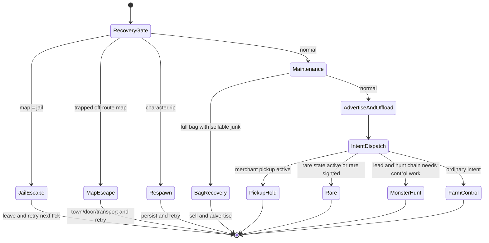
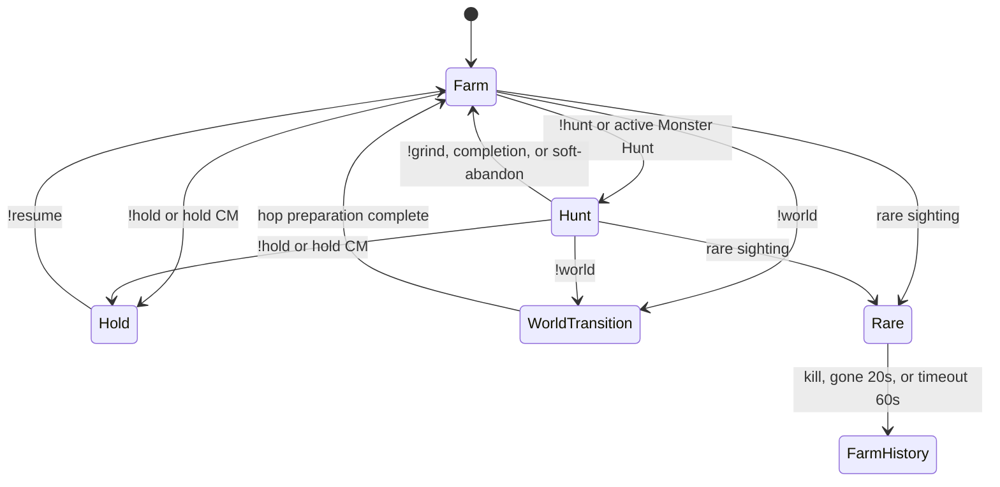
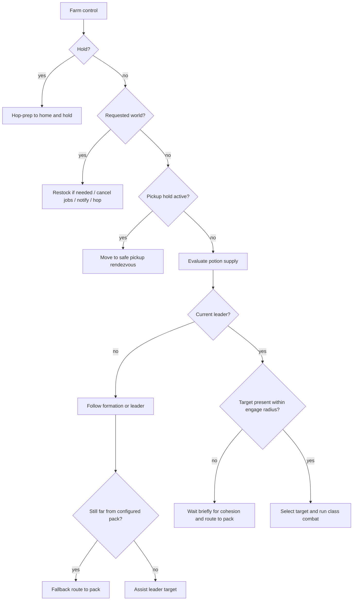
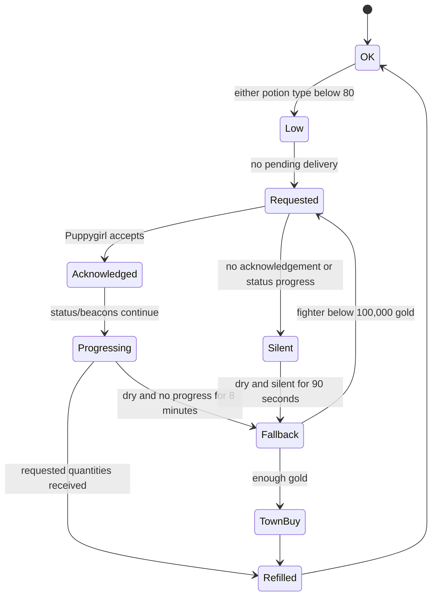
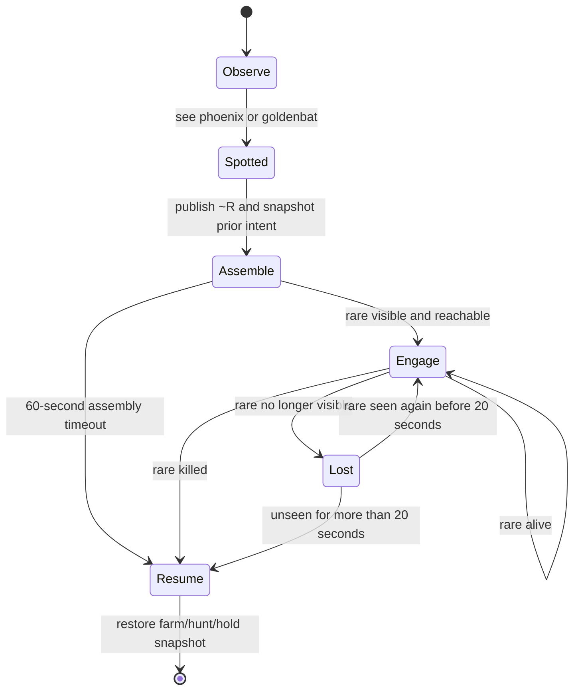
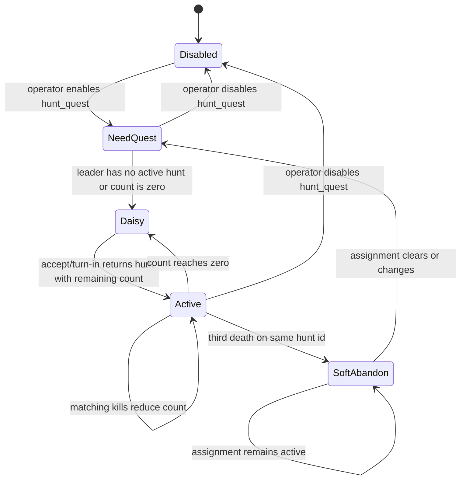
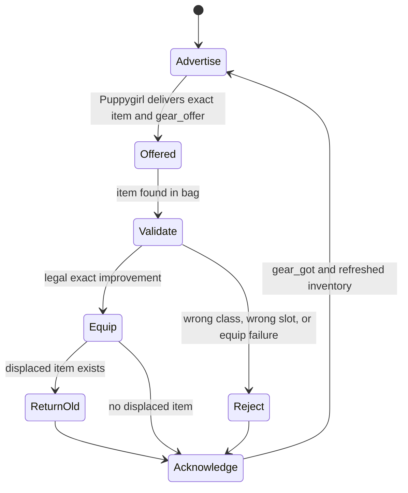

# Fighter Requirements and State Machines

**Status:** normative  
**Locked:** 2026-09-13  
**Scope:** Jazwyn, Sarene, and Zarook

This document is the authority for fighter behavior. Party-wide structure is
defined in [`SYSTEM_ARCHITECTURE.md`](SYSTEM_ARCHITECTURE.md), merchant
behavior in [`MERCHANT_PLAN.md`](MERCHANT_PLAN.md), and wire formats in
[`docs/INTERFACE_CONTROL_DOCUMENT.md`](docs/INTERFACE_CONTROL_DOCUMENT.md).

## 1. Operating objective

The fighters act as one field unit. One deterministic leader owns shared
intent; the other two maintain formation, assist the leader's target, and
preserve class roles. Fighters survive local failures, request logistics
without leaving the farm unless fallback is required, advertise their exact
inventory, and cooperate with Puppygirl's pickup and delivery jobs without
risking equipped or reserved upgrade items.

The order of concern is:

1. Escape invalid maps and recover from death.
2. Use emergency potions and preserve life.
3. Honor active upgrade pickup reservations and rendezvous.
4. Resolve rare interrupts.
5. Advance the lead-owned Monster Hunt chain.
6. Maintain potion supply and bag capacity.
7. Follow shared farm/hunt/hold/world intent.
8. Maintain formation and class combat responsibilities.
9. Advertise inventory, offload loot/gold, and improve equipment.

## 2. Locked requirements

| Area | Requirement | Implementation |
| --- | --- | --- |
| Leadership | Exactly one current leader is selected in order `Jazwyn -> Sarene -> Zarook`, excluding absent or dead fighters. Leadership returns to Jazwyn when she returns. | Implemented |
| Intent ownership | Only the current leader writes farm/hunt target, hold, requested world, and normal shared mode. Followers consume that intent. | Implemented |
| Cohesion | Followers never independently select a different farm while a leader is available. Cross-map movement begins with a cohesion wait; followers use leader-relative formation and pack fallback. | Implemented |
| World changes | Fighters never world-hop for normal farming, potions, gear, or rares. Only explicit hold/world control invokes hop preparation. | Implemented |
| Hold | Hold is a long-lived operator assembly state on the configured home world; resume returns to prior farm/hunt operation. | Implemented |
| Rare | Any fighter may interrupt for `phoenix` or `goldenbat`; all fighters assemble on the spotter, fight, and restore prior intent on kill/gone/timeout. | Implemented |
| Monster Hunts | The current leader owns Daisy accept/farm/turn-in. Three deaths on one assignment soft-abandon it until it clears. | Implemented |
| Potions | Use HP below 55% and MP below 50%; request restock below 80 units; at zero, preserve delivery state and use same-world town fallback only after silence. | Implemented |
| Potion demand | Request only each potion type's deficit to target; omit a type that is not short. | Implemented |
| Gold | Keep `100,000` gold for fallback purchasing and send only excess to Puppygirl when she is in range. | Implemented |
| Full bag | Sell approved junk, never reserved gear. If one potion type is dry and the other monopolizes the bag, sell surplus of the abundant type to free a slot. | Implemented |
| Equipment | Equip only class-legal, slot-legal improvements. Score full Hunter bundles with set bonuses weighted 10x so a two-piece Hunter bonus beats +5 store armor. | Implemented |
| Low-tier armor | Bagged `pants`, `gloves`, `helmet`, `shoes`, and `coat` are always NPC-vendor stock at every level. Equipped copies remain safe until replaced. | Implemented |
| Merchant gear | Accept a merchant gift only when the exact item can be equipped; acknowledge the result and return displaced/surplus items while Puppygirl remains in range. | Implemented |
| Gear routing | Never exchange gear directly with another fighter. Offload requested items to Puppygirl and accept upgrades only from Puppygirl. | Implemented |
| Upgrade pickup | On authenticated request, meet Puppygirl and offload only the exact unlocked Hunter/progression items requested. | Implemented |
| Inventory ads | Publish revisioned equipment, bag, capacity, location, world, class, and reservation snapshots every 20 seconds and after material changes. | Implemented |
| Chat | All CODE-originated party messages use a per-character 16-second queue with `echo > rare > diff > heartbeat` priority. | Implemented |
| Status publication | Potion bucket, task, and death changes publish independently, including explicit living/dead state. | Implemented |
| Recovery | Leave jail, escape trapped event maps, respawn, reload persisted state, re-form the party, and resume intent without a path or hop storm. | Implemented |

## 3. Top-level fighter state machine

The fighter controller is a single-flight 250 ms tick. Class combat is invoked
from the shared controller only when movement, recovery, pickup, and gear
transactions allow it.



### 3.1 Tick priority

1. Leave jail.
2. Escape an event/dead-end map that cannot route to the intended farm.
3. Respawn and account for a Monster Hunt death.
4. Use emergency HP/MP potions.
5. Refresh leader-presence hysteresis.
6. Run routine maintenance:
    - loot;
    - strip wrong-class equipment;
    - sell junk if the bag is full;
    - equip safe improvements.
7. Publish a fresh gear advertisement when due.
8. Offload eligible loot and excess gold to nearby Puppygirl.
10. Emit metrics and service the chat queue.
11. Run pickup hold, rare interrupt, Monster Hunt control, or ordinary farm
    control in that priority order.

## 4. Shared intent and leadership



The current leader is the first eligible fighter in the configured order.
The leader emits a complete heartbeat at most once per minute after the boot
quiet period. Before publishing after succession/reload, its sequence advances
above every sequence it has heard.

Followers may update local execution state but may not overwrite shared
intent. A leader heartbeat older than the stored sender sequence is ignored.

### 4.1 Live death handling

Leadership filters the live party roster's death flags before consulting the
shared state. A dead-but-present fighter therefore yields immediately to the
next living fighter, and Jazwyn reclaims leadership after recovery.

## 5. Farm, formation, and combat



### 5.1 Formation

- Enter present/formed state when the leader is visible within 220 pixels.
- Exit only after loss of vision or distance beyond 400 pixels persists for
  20 seconds.
- Sarene and Zarook use face-relative formation offsets.
- Formation re-anchors after 70 pixels of leader drift.
- Within 18 pixels of the formation slot, stop movement; within 220 pixels,
  use direct movement when farther than 40 pixels; otherwise use
  `smart_move`.
- If leader coordinates are missing or stale and the follower remains more
  than 400 pixels from the intended pack, route to the configured pack rather
  than idling in town.

### 5.2 Combat roles

| Role | Behavior |
| --- | --- |
| Current leader | Selects a configured pack target and becomes the party's target source |
| Followers | Prefer the visible leader's current target; otherwise select a matching pack target |
| Jazwyn | Closes to melee, uses charge while approaching, cleaves only with a compatible weapon and sufficient MP |
| Sarene | Holds mage formation and attacks from range |
| Zarook | Revives first, party-heals multiple injured members, heals the lowest member, then curses/attacks |

No class combat runs while dead or during active smart movement. Wrong-class
and incompatible two-hand/offhand equipment is rejected rather than retried
every tick.

## 6. Potion and fallback state machine



The fighter supplies its current world and location with the request and
responds to merchant meet probes with fresh beacons. Acknowledged work receives
the longer eight-minute path budget because cave and cross-map routes can take
minutes.

The lead waits while dry. A dry follower still closes on the leader/pack so it
does not become stranded, but it does not fight.

### 6.1 Locked per-type demand correction

The target request is:

```text
need(hpot1) = max(0, POTION_TARGET - current HP potion count)
need(mpot1) = max(0, POTION_TARGET - current MP potion count)
```

Only positive entries belong in `dlv_pots.items`. If both are zero, no request
is created. Puppygirl's send loop honors the same demand map.

## 7. Rare interrupt state machine



Rares are located through the spotter and visible entity coordinates. Fighters
never call `smart_move({to: "phoenix"})` or route to a rare by monster type.
Puppygirl is not part of the rare state machine.

## 8. Monster Hunt state machine



Only the current leader interacts with Daisy. Followers consume the leader's
resulting hunt intent. Merchants cannot accept Monster Hunts.

## 9. Gear state machines

### 9.1 Merchant gift



Gift TTL protects the delivered item while equip logic runs. A progression
winner returns the displaced former baseline directly when possible. Other
non-keep items and excess gold are offloaded while Puppygirl is still in
range.

### 9.2 Upgrade pickup

On an authenticated pickup status, the fighter enters a pickup hold for up to
eight minutes, travels to the safe plaza rendezvous, and advertises that
location. It offloads only requested names and levels:

- Hunter pickup may temporarily unequip configured Hunter pieces.
- Duplicate progression pickup never sends the equipped baseline.
- Locked items are never sent.
- Completion clears pickup hold and returns the fighter to unchanged party
  intent.

## 10. Inventory and cleanup

1. Loot during routine maintenance.
2. Never move an upgrade-offload-reserved item through ordinary equip, sale,
   or merchant offload.
3. Strip class-illegal equipment when a bag slot is available.
4. Equip class/slot-legal improvements; use full-loadout set scoring for
   Hunter gear.
5. If the bag is full, NPC-vendor configured junk until at least one slot is
   free.
6. Offload non-keep loot and gold above the fighter floor whenever Puppygirl
   is visible within 320 pixels.
7. Advertise immediately after material inventory movement and at least every
   20 seconds.

Equipped low-tier armor is safe. Once replaced and moved into the bag, it
becomes ordinary NPC-vendor stock.

## 11. Communication and persistence

### 11.1 Party chat

| Message | Purpose |
| --- | --- |
| `~S` | Leader heartbeat containing shared farm/mode/hold state and sequence |
| `~d` | Fighter-local potion/rip/task diff |
| `~R` | Rare sighting |
| `!hold`, `!resume`, `!hunt`, `!grind`, `!world` | Operator intent commands |

Messages share one throttled queue per fighter. New messages of the same kind
replace older pending ones. Higher-priority messages replace lower-priority
pending work.

### 11.2 CM

CM carries delivery requests/status, inventory advertisements, gear
transactions, pickup requests, and merchant controls. Fighters accept merchant
control only from Puppygirl. Puppygirl accepts fighter state only when the
platform sender matches the claimed fighter.

### 11.3 Persistent state

Each fighter persists:

- shared intent, mode, lead, and observed sequences;
- rare snapshot and deadlines;
- pending delivery and latest progress;
- Monster Hunt enablement, death counter, and soft-skip assignment;
- inventory revision;

Heap-only timers, handlers, and cached visibility are reconstructed after
reload. The lead waits through a boot quiet period, reseeds its sequence, and
then republishes.

## 12. Known gaps and limits

| Gap | Consequence |
| --- | --- |
| Plain `Transfer ...` and `World ...` notices are not parsed by current party-state parser | They are informational output, not reliable movement control |

## 13. Acceptance and change control

A fighter transition is accepted only when:

1. All three classes and every boot subset continue to operate.
2. Deterministic scenarios cover leadership, formation, rare, supply, gear,
   death, reload, and path failure behavior.
3. Long-run simulation shows zero fighter world hops outside explicit control,
   zero chat throttles, and no path/request storm.
4. Production bundles remain within the Adventure Land slot limit.
5. Live visual and log review confirms the expected class and party behavior.
6. Each behavior change and its tests form one focused commit.
7. This document changes in the same commit whenever fighter requirements or
   state transitions change.
