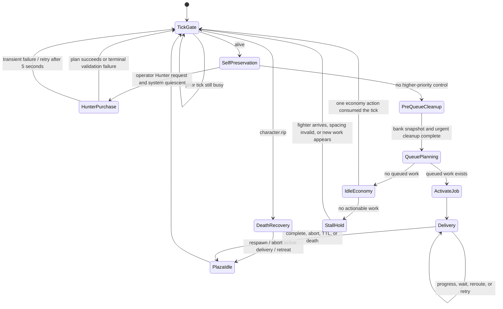
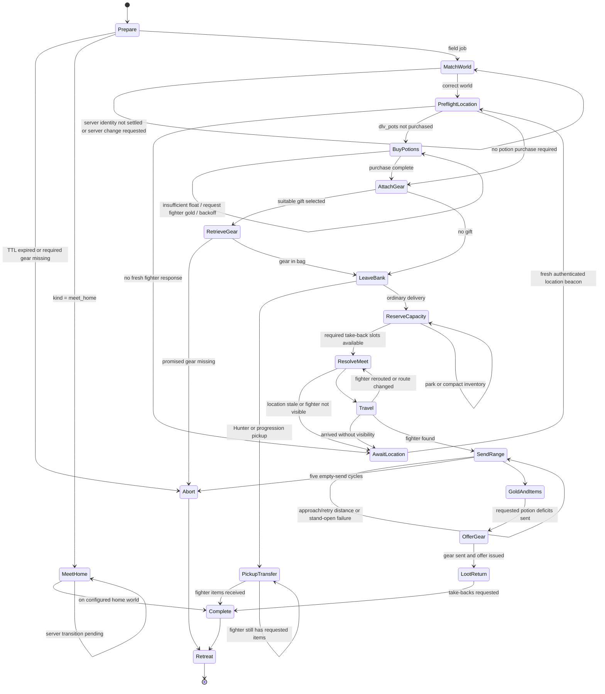
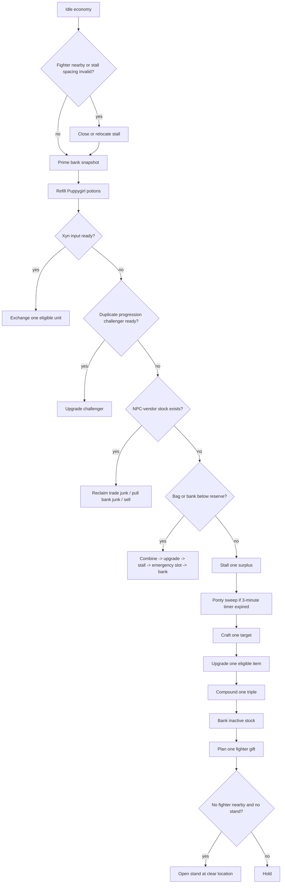
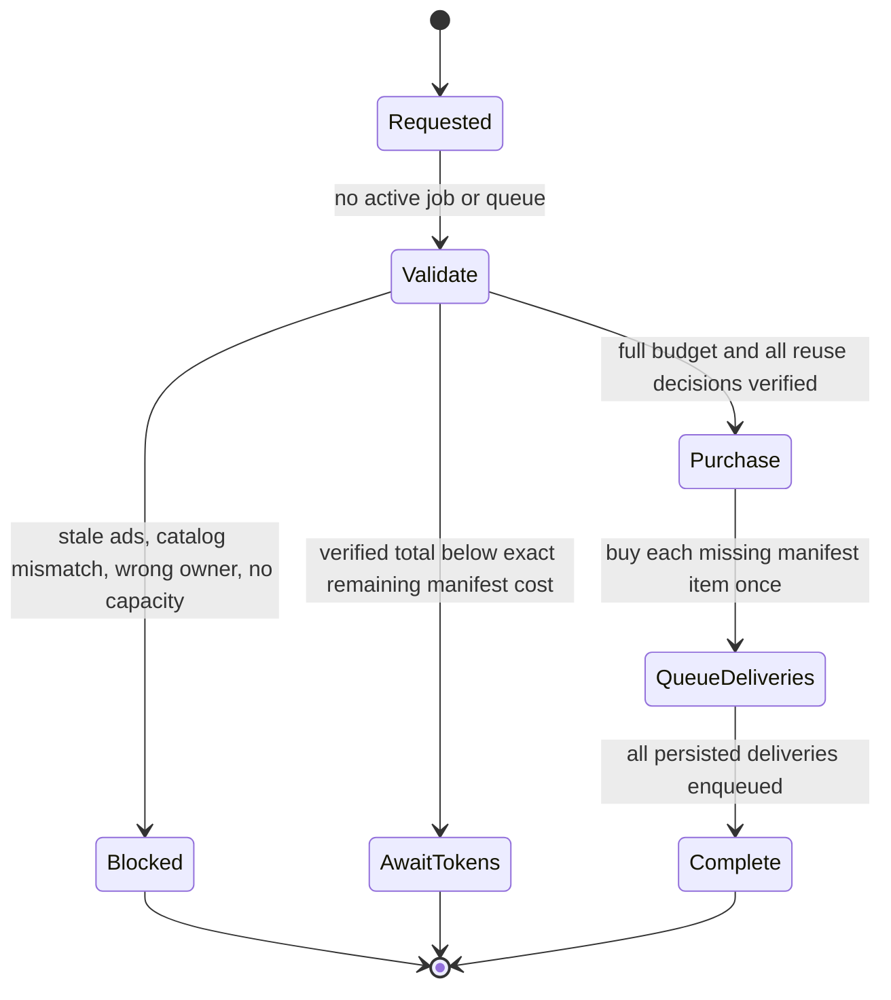
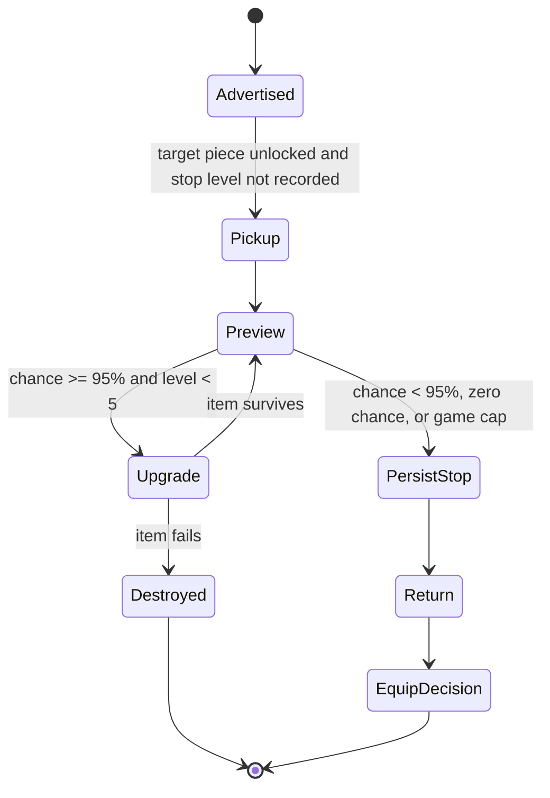
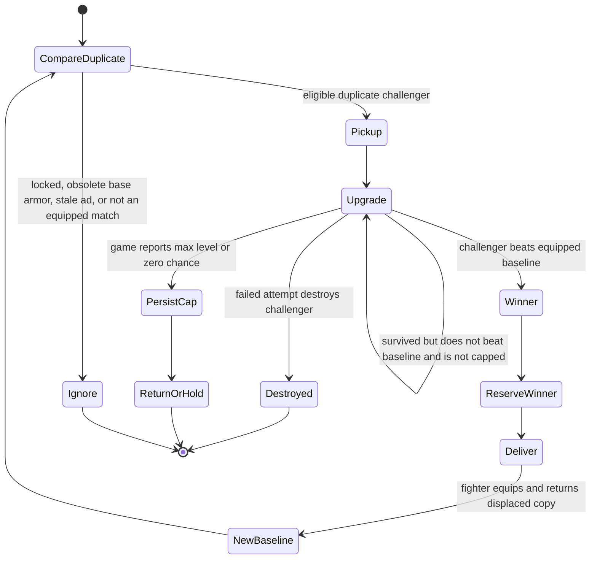
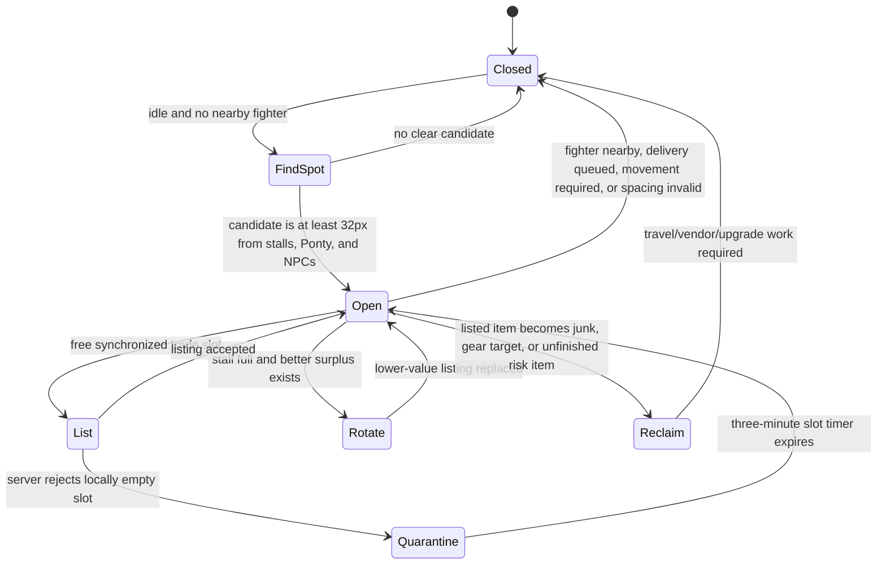
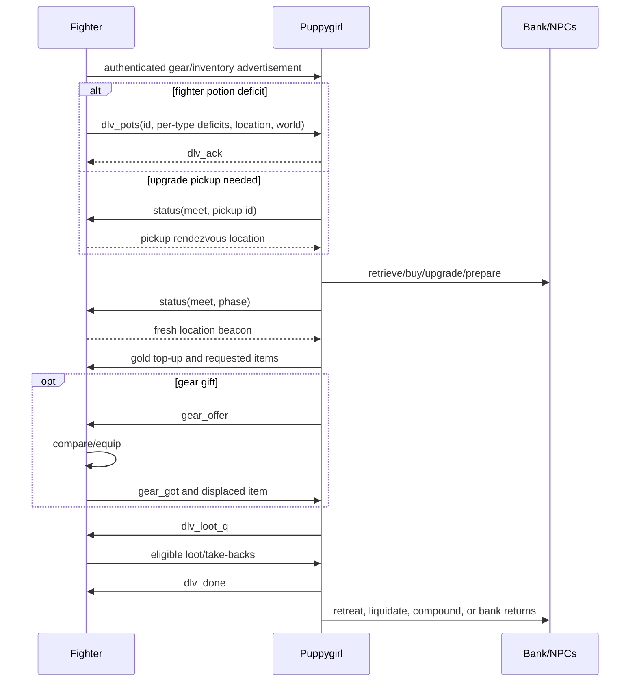

# Puppygirl Merchant Requirements and State Machine

**Status:** normative  
**Locked:** 2026-09-13  
**Scope:** Puppygirl's logistics, inventory, progression, and market behavior

This document is the authority for merchant behavior. When it conflicts with
older planning language in `V2_PLAN.md`, `README.md`, or
`docs/MONSTER_TOKEN_PROGRESSION.md`, this document wins. The interface wire
formats remain authoritative in `docs/INTERFACE_CONTROL_DOCUMENT.md`.
Party-wide structure is summarized in
[`SYSTEM_ARCHITECTURE.md`](SYSTEM_ARCHITECTURE.md), and fighter behavior is
normative in [`FIGHTER_PLAN.md`](FIGHTER_PLAN.md).

## 1. Operating objective

Puppygirl keeps the three fighters supplied and improving without interrupting
their farm loop. She owns shared-bank access, purchasing, upgrading,
compounding, crafting, exchanges, liquidation, and player-market sales.

The order of concern is:

1. Stay alive and keep enough personal potions to operate.
2. Complete accepted fighter logistics jobs.
3. Protect equipped, reserved, in-transit, and progression-winning gear.
4. Relieve bag and bank pressure.
5. Improve fighter equipment.
6. Convert surplus inventory into gold.
7. Hold a safe, useful stall when no higher-priority work exists.

Fighters do not travel to the bank as part of the locked design. Fighter
self-service bank pickup remains a deferred alternative, not a requirement.

## 2. Locked requirements

| Area | Requirement | Implementation |
|---|---|---|
| World | Normal logistics and idle economy stay on the party's farm world. World changes occur only to follow a delivery or fulfill explicit hold/home control. | Implemented |
| Delivery | Potions and gear travel through the persisted FIFO delivery queue. Fighters keep farming; Puppygirl approaches to item-send range. | Implemented |
| Potion demand | A restock job contains only the potion types and quantities that the fighter is short on. Unneeded HP or MP potions must not accumulate. | Implemented |
| Gold | Fighters retain `100,000` gold and Puppygirl retains `150,000` gold. A delivery may top up a fighter below its float. | Implemented |
| Capacity | Puppygirl reserves at least three bag slots for fighter take-backs and four slots during economy batches; the bank retains a twelve-slot logistics reserve. | Implemented |
| Bank | Inactive stock is banked. Operational consumables, tools, exchange inputs, immediate vendor stock, listed merchandise, fighter targets, and active progression items remain available when needed. | Implemented |
| Low-tier armor | `pants`, `gloves`, `helmet`, `shoes`, and `coat` are never bought, upgraded, reserved, or stall-listed. Every unlocked merchant- or fighter-bag copy is NPC-vendored at every level. Equipped copies are never touched. | Implemented |
| Hunter acquisition | Buy only the configured fifteen Warrior, Mage, and Priest Hunter pieces, after validating the catalog, ownership, fresh recipient advertisements, capacity, and the complete token budget. | Implemented |
| Hunter upgrades | Upgrade configured Hunter pieces through the last preview with at least `95%` success chance, never beyond `+5`. Persist the first lower-chance or game-cap stop. | Implemented |
| Duplicate progression | If an unlocked duplicate matches a fighter's equipped item, risk the duplicate until it is destroyed, game-capped, or becomes the superior winner. Never risk the equipped baseline. Deliver a winner before it can be sold, banked, listed, or upgraded again. | Implemented |
| Set choice | Gear comparison scores the whole loadout, including class legality, class stats, Hunter set breakpoints, and special effects. A set is delivered/equipped only when the resulting loadout is better. | Implemented |
| Exchanges | Anniversary gifts, emeralds, boxes, and other configured Xyn inputs outrank normal cleanup when an output slot can be preserved. Smaller eligible stacks drain first. | Implemented |
| Crafting | Craft the Orb of Beginnings, pickaxe, and rod from owned/banked ingredients; retrieve ingredients only when needed. | Implemented |
| Ponty | Search only for configured quotas. Retry a failed request no faster than once per second; after a complete sweep, wait three minutes before checking again. | Implemented |
| Stall | List only configured surplus at policy prices and levels. Keep the stall at least 32 pixels from other stalls, Ponty, and all NPCs. Do not reopen or relocate while a fighter transfer is pending. | Implemented |
| Stale stall slots | A locally empty trade slot rejected by the server is quarantined for three minutes. | Implemented |
| Failure behavior | Path, range, full-bag, stale-location, and server-transition failures remain explicit and retryable. No failure may be converted into a success-shaped result or an infinite movement/listing loop. | Implemented |
| Observability | Material transitions emit stable `game_log` events. Every behavior change receives adversarial simulation coverage and live visual/log review in its own commit. | Process requirement |

## 3. Top-level state machine

The implementation is a cooperative hierarchical state machine evaluated by a
single-flight tick. Transitions shown earlier in a decision list have higher
priority.

### 3.1 Tick priority

Each tick executes at most one long-running branch:

1. Ignore re-entry while another tick owns the controller.
2. If dead, respawn, abort an active delivery, notify the fighter, and
   retreat to the plaza.
3. Use emergency HP/MP potions.
4. If an operator-requested Hunter purchase is pending and all queues are
   empty, attempt it.
5. Prime the live bank snapshot before planning from bank contents.
6. When there is no active job:
   - vendor urgent junk before new pickups;
   - create capacity if bank junk is blocked by a full bag;
   - park inactive inventory when it is safe to do so.
7. When fully idle, enqueue at most one pickup in this order:
   Hunter-upgrade pickup, duplicate-progression pickup, saturation cleanup.
8. Promote the FIFO queue head to `active`.
9. Run the active delivery; otherwise run one idle-economy action.

## 4. Delivery job state machine

### 4.1 Queue contract

- Ordinary queue capacity is eight jobs. A Hunter manifest may queue all
  fifteen configured deliveries.
- Job IDs deduplicate queued work.
- Jobs persist in `localStorage` across CODE reloads and server changes.
- The eight-minute TTL starts when a queued job becomes active, not while it
  waits in the queue.
- Accepted kinds are:
  - `dlv_pots`: requested potion deficits, optionally carrying one gear gift;
  - `dlv_gear`: standalone gear gift or saturation pickup;
  - `hunter_upgrade`: retrieve Hunter pieces from a fighter;
  - `progression_upgrade`: retrieve duplicate challengers from a fighter;
  - `meet_home`: explicit hold/home rendezvous.

### 4.2 Delivery transitions

### 4.3 Delivery invariants

1. The stand is closed before movement or item transfer.
2. The destination comes from a fresh, authenticated fighter beacon. A moving
   party can reroute the job; old pack coordinates are not authoritative.
3. Named farm routes are used only for confirmed cross-map farm movement.
4. Puppygirl approaches a safe point within the 320-pixel transfer radius
   rather than walking into the monster pack.
5. At least three bag slots are available before an ordinary handoff. Upgrade
   pickups reserve `max(3, pickup count + 1)`.
6. A fighter below the gold floor may be topped up before item transfer.
7. A `dlv_pots` job sends only quantities present in its `items` demand map;
   fighters generate that map from actual per-type shortages.
8. A successful gear send is followed by `gear_offer`; the fighter equips,
   acknowledges, and returns the displaced item.
9. Completion or abort clears the active job, persists queue state, and
   retreats from the field.

## 5. Idle-economy state machine

Idle economy performs one useful action and returns to the tick loop. This
prevents a long maintenance batch from starving newly arrived deliveries.

### 5.1 Economy priority and ownership

| Priority | Work | Key guard |
|---:|---|---|
| 1 | Personal potion refill | Survival before optional spending |
| 2 | Xyn exchange | Preserve at least one emergency output slot |
| 3 | Duplicate challenger upgrade | Protect useful duplicate before liquidation |
| 4 | NPC liquidation | Includes all five obsolete base-armor names at all levels |
| 5 | Capacity recovery | Combine/upgrade/list before sacrificing designated cheap material |
| 6 | Stall listing | Configured surplus only; strongest eligible/highest-value copy first |
| 7 | Ponty sourcing | Quotas only; fair-price cap; three-minute completed-sweep cooldown |
| 8 | Crafting | Configured tools and Orb of Beginnings |
| 9 | Ordinary/Hunter/risk upgrade | Correct grade scroll and policy-specific stop |
| 10 | Compounding | Complete same-name/same-level triples |
| 11 | Banking | Everything outside the active working set |
| 12 | Gift planning | Fresh fighter advertisements and strictly better loadout |
| 13 | Stall hold | Only when no actionable work remains |

## 6. Inventory classification

Every item must belong to one current action class. Higher rows override lower
rows.

| Class | Examples | Allowed destination |
|---|---|---|
| Equipped | Any item in a character equipment slot | Never moved by cleanup |
| In-flight/reserved | Active gift, Hunter purchase, progression winner | Required recipient only |
| Operational carry | `hpot1`, `mpot1`, stand, tracker, pickaxe, rod, required scrolls/offerings | Puppygirl bag |
| Immediate consumption | Xyn inputs, vendor junk, craft/compound/upgrade batch | Relevant NPC/action |
| Fighter target | Configured Hunter pieces, earrings, cape, weapons/offhands | Best fighter or protected storage |
| Progression challenger | Duplicate of currently worn fighter gear | Upgrade NPC until winner/destruction/cap |
| Stall surplus | Item satisfying a `STALL_SELL` rule after global keep count | Player stall |
| Inactive stock | Materials, currencies, non-actionable reserves | Bank |

Global keep counts include equipped, fighter-bag, Puppygirl-bag, banked, and
already-listed copies. Cleanup may never infer that an equipped item is
available merely because another copy is wanted.

## 7. Gear progression submachines

### 7.1 Hunter acquisition

Purchasing is all-or-nothing for the verified remaining manifest. Existing
owned pieces are reused. Ranger, Rogue, Paladin, and Merchant Hunter pieces
are outside the locked manifest.

### 7.2 Hunter upgrade loop

### 7.3 Duplicate progression loop

Unlike Hunter upgrades, duplicate progression has no minimum success chance.
The safety boundary is item identity: only the spare challenger is risked.

## 8. Stall state machine

A completed Ponty sweep is not stall work and cannot cause a repeated
open-close-Ponty loop: the next eligible sweep is three minutes later.

## 9. Failure and backoff table

| Failure | Required transition |
|---|---|
| Merchant death | Respawn, fail active pot/gear job, notify recipient, retreat |
| Delivery older than eight active minutes | Clear active job and retreat |
| Missing promised gear | Abort with `gear_missing`; never claim success |
| Fighter location stale | Send status probe; wait for a matching location beacon |
| Fighter moves during route | Stop stale route, mark reroute, retreat/re-resolve |
| Path failure | Log, nack where applicable, retain retryable state |
| Transfer distance/stand-open failure | Close stand, reacquire range, retry same item |
| Empty send | Retreat after each miss; abort after five |
| Fighter bag full | Wait while preserving the job; fighter cleanup creates space |
| Bank store failure | Log actual reason; emit `bank:full` only when no vault slot exists |
| Full bag blocks bank junk | Combine a local triple or sacrifice only a designated emergency item |
| Compound blocked by space | Log no faster than every 15 seconds |
| Ponty request failure | Retry no faster than once per second |
| Ponty completed sweep | Sleep the sweep for three minutes |
| Stale trade slot | Quarantine that slot for three minutes |
| Temporary Hunter purchase failure | Retry after five seconds |
| Terminal Hunter validation failure | Clear operator request and require a new one |

## 10. Cross-actor state summary

## 11. Deferred decisions

These are explicitly outside the locked state machine:

- Fighters independently visiting the bank for upgrades.
- Purchasing or completing Puppygirl's Merchant Hunter set.
- Buying low-tier vendor armor as upgrade feed.
- Returning low-tier displaced fighter armor to long-term storage.
- World-hopping for routine potion or gear logistics.
- Expanding Ponty purchases beyond configured quotas.

They require an explicit requirement change, a state-machine update, adversarial
tests, a separate commit, production deployment, and live observation.

## 12. Acceptance and change control

A state transition is accepted only when:

1. Its deterministic unit or scenario tests pass.
2. Relevant long-running/adversarial simulations show no chat throttle,
   fighter world hop, inventory bounce, repeated path storm, or stale-slot
   storm.
3. Generated production slots remain within the platform line limit.
4. The behavior is deployed and visually observed on the intended server.
5. Logs show the expected transition and no contradictory action.
6. The behavior change and its tests form one focused commit.
7. This document is updated in the same commit whenever the locked state
   machine changes.
