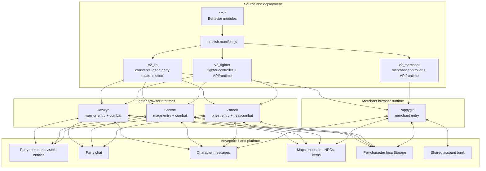
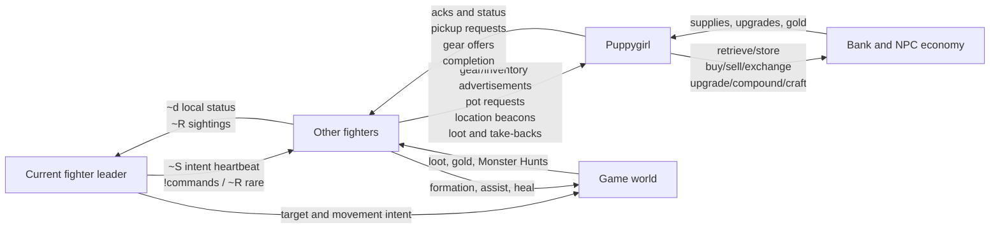
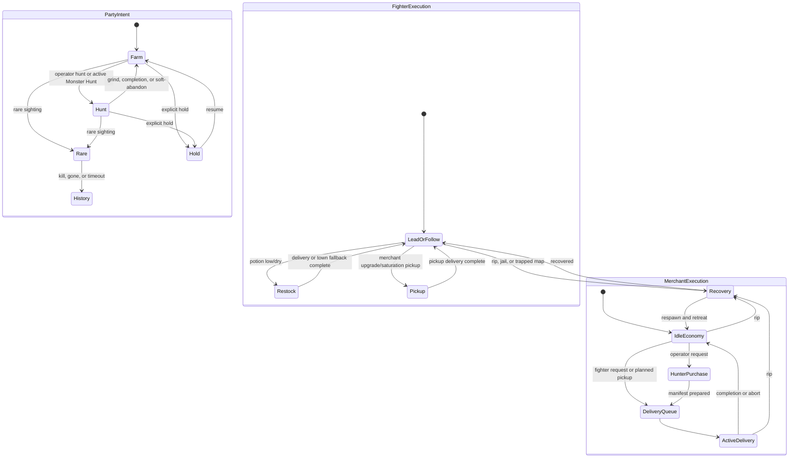
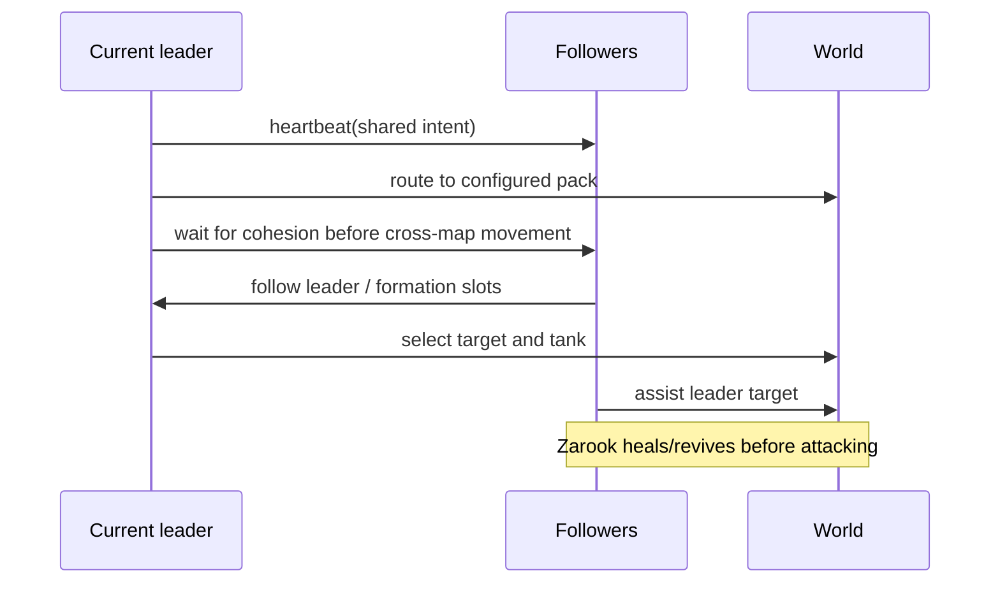
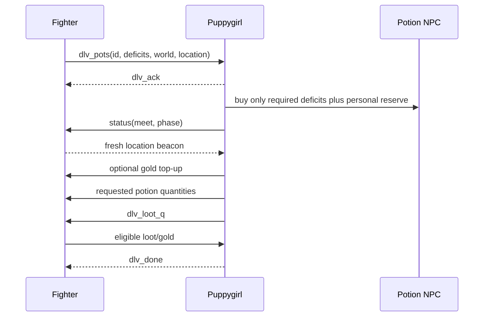
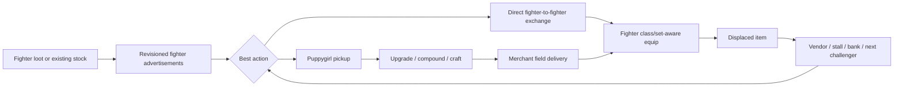
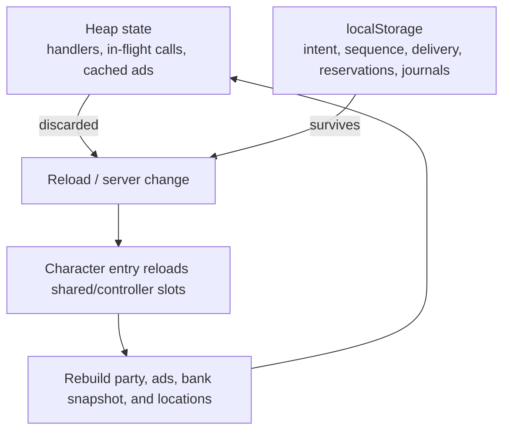

# Adventure Land Party System Architecture

**Status:** normative overview  
**Locked:** 2026-09-14

This document explains how the four-character system is structured and how
its state machines interact. Detailed behavior is normative in:

- [`FIGHTER_PLAN.md`](FIGHTER_PLAN.md) for Jazwyn, Sarene, and Zarook;
- [`MERCHANT_PLAN.md`](MERCHANT_PLAN.md) for Puppygirl;
- [`docs/INTERFACE_CONTROL_DOCUMENT.md`](docs/INTERFACE_CONTROL_DOCUMENT.md)
  for message schemas and persistence contracts.

If an older proposal conflicts with one of these documents, the newer
normative document wins.

## 1. System objective

The party is a coordinated, unattended farming system:

- one fighter owns shared intent;
- all fighters remain together and fight on one world;
- Puppygirl supplies and improves them without pulling them out of the field;
- inventory flows from fighters to Puppygirl, then to use, upgrade, exchange,
  sale, stall, or bank;
- reloads and server changes preserve intent and active logistics work;
- simulation and live logs enforce the same operational invariants.

The party is:

| Character | Class | Primary responsibility |
|---|---|---|
| Jazwyn | Warrior | Preferred leader, tank, target selection |
| Sarene | Mage | Formation damage; first successor |
| Zarook | Priest | Healing, revive, support damage; second successor |
| Puppygirl | Merchant | Supply, bank, progression, cleanup, and market |

## 2. Runtime structure

Each character runs independently. There is no shared heap or synchronous
transaction manager. Coordination uses platform-visible state, party chat, CM,
merchant-mediated item/gold transfer, and persisted per-character state.

## 3. Control plane and data plane

### 3.1 Authority boundaries

| State | Owner | Observers/consumers |
|---|---|---|
| Farm/hunt target, hold, requested world | Current fighter leader | Other fighters; Puppygirl indirectly through jobs/ads |
| Fighter health, potions, bag, equipment, location | That fighter | Leader and Puppygirl |
| Delivery queue and active logistics job | Puppygirl | Job recipient through acknowledgements/status |
| Shared bank inventory | Puppygirl | Fighters only through resulting deliveries |
| Rare sighting | First observing fighter | Entire fighter party |
| Monster Hunt chain | Current fighter leader | Followers through shared intent |

An owner may publish its state; observers may not rewrite it. Name-based sender
gates protect CM flows from other party characters, but they are not
cryptographic authentication.

## 4. Interacting state machines

The three machines are orthogonal:

- **Party intent** says what the fighters are trying to do.
- **Fighter execution** says how each fighter fulfills that intent while
  surviving local conditions and cooperating with logistics.
- **Merchant execution** services supply and economy work without owning
  combat intent.

  ### 4.1 Fighter tick interfaces

  Encounter execution has two independent owners:

  1. `PartyMovementImplementation` receives the immutable tick frame and returns
     exactly one movement directive for the local fighter plus advisory peer
     posture information.
  2. `PartyCombatRunner` receives the same resolved target and invokes the
     local action-only class rotation.

  Both run on every eligible encounter tick. Combat rotations cannot move, and
  movement implementations cannot attack or heal. `EncounterMovement` owns
  holding, approach, fleeing-target interception, visible-peer separation, and
  ranged kiting. Cross-map routing, recovery, rare assembly, and logistics holds
  remain separate movement modes and never run concurrently with encounter
  movement.

  The deployment remains physically distributed: each browser may execute only
  its own directive. Peer posture is advisory, stable identity determines
  formation side and yield priority, and stale party-list coordinates are never
  used for local collision avoidance.

A rare interrupt temporarily overrides farm/hunt execution but does not erase
the prior intent. A pickup hold temporarily overrides fighter movement but
does not rewrite party intent. An ordinary delivery does not stop followers
from maintaining formation; only a dry lead waits in place.

## 5. Primary interaction paths

### 5.1 Farm and formation

### 5.2 Potion delivery

The fighter computes each potion deficit independently, omits satisfied types,
and Puppygirl sends only the resulting demand map.

### 5.3 Gear lifecycle

The equipped baseline is never risked. The merchant reserves an upgrade winner
until delivery. Obsolete base armor returned by a fighter goes directly to the
NPC vendor.

### 5.4 Rare interrupt

Any fighter can sight a configured rare and publish `~R`. All fighters
snapshot their prior intent, assemble on the spotter, fight when the rare is
visible, and restore the snapshot on kill, 20-second loss of sight, or
60-second assembly timeout. Puppygirl does not join this interrupt.

### 5.5 Monster Hunt chain

Puppygirl's operator control toggles the feature, but the current fighter
leader owns it. The leader visits Daisy, accepts or turns in the quest, writes
the assigned monster into party intent, and returns to Daisy at zero remaining
kills. Three deaths on the same assignment cause a soft-abandon to the default
farm until that assignment clears.

## 6. Persistence and recovery

Fighter intent, pending delivery, rare/Monster Hunt state, and inventory
revision persist per fighter. Puppygirl's delivery queue, active job,
progression stops/winners, and Hunter request state persist separately. Bank
snapshots and fighter advertisements are refreshed after restart rather than
treated as permanently authoritative.

## 7. Safety invariants

1. Fighters do not world-hop for routine supplies or gear.
2. Followers do not independently choose a farm while a leader is available.
3. The party has one deterministic intent writer:
   `Jazwyn -> Sarene -> Zarook`.
4. Equipped items are never cleanup inputs.
5. Only spare duplicates are exposed to unlimited-risk progression.
6. The merchant closes the stand before movement or transfer.
7. Transfer requires the same map, visibility/range, and recipient capacity.
8. Jobs, item references, and acknowledgements are matched by identity and
   sender; stale observations fail closed.
9. Capacity recovery may sacrifice only configured low-value emergency stock.
10. Every successful or failed material transition is visible in logs.
11. CODE-originated party chat remains behind the per-character 16-second
    queue.
12. Simulation, generated production bundles, and live behavior derive from
    the same `src/` modules.

## 8. Known gaps and limits

| Gap | Effect | Authority |
|---|---|---|
| Best-effort CM/chat | Delivery is not guaranteed by the platform; application acknowledgements, retries, TTLs, and fallback provide recovery. | Accepted platform constraint |
| Fighter bank self-service | Fighters intentionally stay in the field; Puppygirl is the exclusive bank and gear-routing authority. | Intentional architecture |

## 9. Build, simulation, and deployment boundary

`src/` is the source of truth. `publish.manifest.js` assembles:

- `v2_lib` for shared policy/state/motion/gear helpers;
- `v2_fighter` for the common fighter controller;
- `v2_merchant` for Puppygirl's controller;
- one small class entry per character.

`dist/` is generated and never edited manually. The simulator boots the same
controllers against modeled Adventure Land APIs, time, pathing, comms,
storage, inventory, and combat. Production acceptance additionally requires
slot-size validation, upload, character reload, visual inspection, and log
examination.
