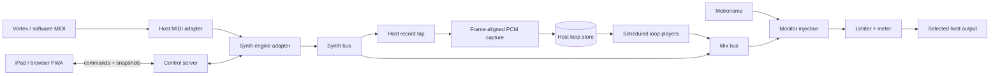

# Web Synth and Looper Architecture Research

Research date: 2026-08-28

## Original browser-engine recommendation

This section records the initial browser-owned engine investigation. It is superseded for implementation by [ADR 0001](docs/adr/0001-host-owned-realtime-engine.md), which moves MIDI, audio, transport, and persistence to the host while retaining the web UI as a remote control surface.

The original proposal was a web-first prototype with TypeScript, Vite, Web MIDI, and Web Audio. The internal synth/processor contract and adapter conclusions remain useful, but browser ownership of MIDI and audio no longer applies. The selected MVP engines remain the built-in subtractive synth and FluidSynth-based SoundFont playback.

Safari cannot own this instrument because it does not expose Web MIDI or direct `AudioContext` output-device selection. It can, however, run the PWA control surface because the host owns those capabilities. [MDN: Web MIDI](https://developer.mozilla.org/en-US/docs/Web/API/Web_MIDI_API) [MDN: AudioContext.setSinkId](https://developer.mozilla.org/en-US/docs/Web/API/AudioContext/setSinkId)

## Canonical host architecture

The host receives Vortex MIDI locally and renders audio directly to the selected host device. It owns the authoritative transport and take state. Browser clients send idempotent commands over WebSocket and receive versioned snapshots plus bounded waveform/meter summaries. No audio-rate control, MIDI performance event, or PCM stream crosses the network.

This makes network latency noncritical to performance timing: notes travel from the Vortex receiver directly into the host engine, and sound travels directly from that engine to the host audio device. UI actions still incur network delay, so quantized actions such as promotion and mute are acknowledged with the engine cycle/frame at which they took effect. On disconnect, the host continues running and a reconnecting client requests the latest full snapshot.

The first implementation uses a software Vortex source and simulated audio engine behind the same interfaces planned for ALSA MIDI and FluidSynth/PipeWire. This permits deterministic transport, mapping, command, and reconnection tests before physical hardware is available.

Use native Web Audio nodes or Tone.js to prove the built-in subtractive synth and transport quickly. Prototype loop capture with an AudioWorklet writing float PCM into preallocated buffers. Compare it with `MediaRecorder`, but expect direct PCM capture to win for bar-exact boundaries, immutable layered takes, loop crossfades, and WAV export.

## What the Vortex provides

Alesis documents 37 velocity-sensitive keys with aftertouch, eight velocity-sensitive RGB pads, eight backlit faders, a MIDI-assignable touch strip and accelerometer, octave controls, sustain, USB-MIDI, traditional MIDI out, and a preset editor that can configure and save controller presets. [Alesis product page](https://www.alesis.com/products/view2/vortex-wireless-2)

The app should not claim factory CC numbers until they are captured from the physical device and checked against the current preset. The editor makes mappings mutable, and multiple MIDI channels or zones may change routing. The robust approach is:

1. Preserve raw MIDI bytes and event timestamps at the input boundary.
2. Normalize MIDI 1.0 channel voice messages without losing channel or source-port identity.
3. Apply a device profile containing learned bindings, ranges, curves, smoothing, and behavior such as momentary/toggle/relative.
4. Route normalized performance events to synth parameters and app commands.
5. Display the raw and interpreted event side by side during setup.

### Hardware validation session

Record a fixture for every physical control over USB and the wireless dongle. Test minimum, center, maximum, press/release, velocity, aftertouch, fast sweeps, simultaneous keys, sustain, preset changes, and every zone. The fixture becomes the basis for parser and mapping tests. Measure event jitter rather than assuming wireless performance.

## Browser capability findings

### MIDI

`navigator.requestMIDIAccess()` exposes input/output maps and connection changes. It requires a secure context, explicit permission, and can be blocked by Permissions Policy. SysEx requires a separate request and is not needed for MVP. MDN's current compatibility data lists desktop Chrome/Edge/Firefox support and no Safari support. [MDN: Web MIDI](https://developer.mozilla.org/en-US/docs/Web/API/Web_MIDI_API)

Design consequence: MIDI enablement belongs to a deliberate setup action. Device hot-plug and permission denial are normal states. The UI mock's connection control is not cosmetic.

### Real-time audio and output routing

AudioWorklet runs custom processing on the Web Audio rendering thread and is broadly available. It is the appropriate place for synth DSP that cannot be expressed as native nodes, PCM loop capture, metering reduction, and boundary crossfades. [MDN: AudioWorklet](https://developer.mozilla.org/en-US/docs/Web/API/AudioWorklet)

`AudioContext.setSinkId(deviceId)` can change output during playback but remains limited availability: current MDN data lists Chrome/Edge/Opera support and no Firefox/Safari support. Access to non-default devices requires permission and may be blocked by the `speaker-selection` policy. Firefox exposes an experimental `selectAudioOutput()` flow, but it routes media elements and is not a portable substitute for direct context routing. [MDN: setSinkId](https://developer.mozilla.org/en-US/docs/Web/API/AudioContext/setSinkId) [MDN: selectAudioOutput](https://developer.mozilla.org/en-US/docs/Web/API/MediaDevices/selectAudioOutput)

Design consequence: model output choice as a capability. Show the system default everywhere; show explicit choices only when the browser can apply them. Report `baseLatency`/`outputLatency` where available, but calibrate audible round-trip behavior on real hardware.

### Clocking

Web Audio's `currentTime` and scheduled node/parameter operations provide the audio clock. A short JavaScript lookahead periodically schedules work against that clock; UI animation follows scheduled beat records rather than acting as the clock. MDN's sequencing guide demonstrates this split and recommends Tone.js as a higher-level option. [MDN: audio scheduling](https://developer.mozilla.org/en-US/docs/Web/API/Web_Audio_API/Advanced_techniques#playing_the_audio_in_time)

Design consequence: transport position, metronome, record gates, loop boundaries, and automation timestamps derive from one timeline. `setInterval`, `requestAnimationFrame`, and React state are never timing authorities.

## Synth and host options

| Option | Strengths | Costs / risks | Recommended role |
|---|---|---|---|
| Native Web Audio nodes | No dependency; standard audio graph; sample-accurate parameter automation; enough for a strong subtractive synth | Voice allocation, modulation routing, presets, and ergonomics are ours | Built-in baseline engine and shared graph |
| Tone.js | DAW-like transport, musical time notation, poly synth wrapper, instruments, effects, flexible routing | Its abstractions can leak into domain state; live-note latency and loop capture still require careful graph design | Prototype accelerator or implementation behind adapters |
| AudioWorklet + custom TypeScript DSP | Precise control, direct PCM capture, off-main-thread processing | DSP complexity and real-time coding constraints | Loop recorder and targeted custom processing |
| Faust to WASM/AudioWorklet | Mature DSP language and potential shared DSP source across targets | Toolchain, generated artifacts, parameter-schema integration, debugging | Spike for a second synth engine |
| Web Audio Modules 2 | Plugin descriptor, audio node, GUI, parameter/state APIs, scheduled MIDI/automation/transport events | Current API repository is `2.0.0-alpha.6`, has no published GitHub releases, and shows limited recent movement | Optional host adapter after MVP contract is stable |
| `js-synthesizer` / FluidSynth WASM | Real SoundFont synthesis, MIDI-oriented API, AudioWorklet support, active recent release history | SoundFont payload/licensing, FluidSynth LGPL boundary, less direct subtractive control | Sampler/SoundFont engine spike |
| Native VST3/AU/CLAP | Large desktop plugin ecosystems and mature tools | Browsers cannot load native plugins; requires a native host and process isolation | Future native companion, not web MVP |

Sources: [Tone.js](https://tonejs.github.io/) · [WAM API](https://github.com/webaudiomodules/api) · [js-synthesizer](https://github.com/jet2jet/js-synthesizer) · [Faust](https://faust.grame.fr/)

### Internal engine contract

Keep this narrower than WAM and translate outward:

```ts
interface HostEngine {
  describeParameters(): readonly ParameterDescriptor[];
  dispatchMidi(event: PerformanceEvent): void;
  execute(command: EngineCommand): Promise<CommandResult>;
  snapshot(): EngineSnapshot;
  subscribe(listener: (event: EngineEvent) => void): Unsubscribe;
  dispose(): Promise<void>;
}
```

`PerformanceEvent` retains MIDI channel and source without exposing an ALSA- or library-specific event. `ParameterDescriptor` supplies stable IDs, ranges, units, curves, defaults, and automation capability. Commands carry unique IDs so reconnecting clients can safely retry them. `CommandResult` identifies the authoritative engine revision and audio frame or cycle where a quantized command took effect.

## Loop engine architecture



### Why direct PCM is favored

Capture occurs inside the host audio callback or native engine, where record gates can open and close at known frame boundaries. Float PCM remains available for immutable takes, boundary crossfades, waveform summaries, WAV output, and MP3 encoding. Browser `MediaRecorder` and AudioWorklet are not part of the production record path.

### Loop state model

- A session owns one `Transport` and an ordered list of tracks.
- A track owns identity, presentation, mix controls, record mode, and one or more takes.
- A take owns PCM/blob storage, sample rate, channel count, exact frame length, source latency offset, and creation tempo/meter.
- Musical length is integer ticks/bars; rendered audio length is integer frames. Conversion is captured at record start.
- Loop addition/removal is dynamic, but audio nodes and buffers are explicitly disposed.
- Metronome is downstream of every track's capture tap.

## Proposed module boundaries

```text
apps/
  web/          installable PWA and selected landscape UI
  server/       HTTPS/WebSocket control server and static assets
packages/
  protocol/     versioned commands, events, snapshots, and schemas
  engine/       host engine contract and deterministic simulated engine
  midi/         normalized events, mappings, software Vortex, ALSA adapter
  synth/        built-in and FluidSynth control adapters
  session/      host persistence, migrations, WAV/MP3 export
native/
  audio/        real-time graph, device output, capture, playback, metronome
```

Audio graph ownership is centralized on the host. UI components issue commands and observe versioned snapshots; they do not connect audio nodes or infer authoritative transport state. The real-time path performs no network or filesystem operations and avoids unbounded allocation.

## Delivery options

| Path | Portability | MIDI/audio routing | Cost | Decision |
|---|---|---|---|---|
| Host engine + remote PWA | iPad and desktop control; private Tailscale delivery | Local MIDI/audio timing; browser latency affects controls only | Medium | Selected |
| Browser-owned engine | Simple single application | No Web MIDI or output selection on iOS; network cannot expose host USB devices | Low | Rejected |
| Native iPad app | Native iOS MIDI/audio access | App distribution and separate engine implementation | High | Future alternative |
| Desktop shell | Local bundled UI | Does not provide the desired iPad control surface by itself | Medium | Optional host UI |

## Prototype sequence and decision gates

1. **Software-device path:** drive the deterministic engine with a software Vortex fixture. Gate: mappings, transport, rollover, staging, promotion, mute, level, delete/undo, and reconnect tests pass without hardware.
2. **Device probe:** capture physical Vortex fixtures and compare them with the software model. Gate: all expressive controls are identifiable; update fixtures rather than domain behavior.
3. **Local latency probe:** measure host MIDI input to host audio output using wired and wireless Vortex connections. Gate: agree on an acceptable measured p95.
4. **Clock/loop probe:** the host captures four bars and null-tests repeated boundaries over ten minutes. Gate: no accumulating drift or click contamination.
5. **Control latency probe:** measure PWA command round trip over local Wi-Fi and Tailscale. Gate: state acknowledgement feels responsive and quantized commands report the correct applied cycle; audio remains unaffected during delay or disconnect.
6. **Engine probe:** run the same parameter protocol against the built-in subtractive synth and FluidSynth-based SoundFont adapter. Gate: no engine-specific branches in the UI.
7. **Scale probe:** 16 stereo takes plus poly synth, waveform summaries, and multiple control clients. Gate: stable audio under client reconnect, suspension, and host device changes.

## Risks to retire early

- Wireless MIDI and Bluetooth host audio can compound latency even though the browser is outside the audio path.
- Host audio device names and availability can change; never silently claim a device was selected.
- Browser suspension and network loss must not stop the host engine; reconnect must replace stale client state with an authoritative snapshot.
- Host disk space makes “arbitrary” take counts finite; expose storage use and reject capture safely before exhaustion.
- Third-party DSP, SoundFonts, presets, and samples have separate licenses; perform a redistribution review before bundling.
- WAM plugin code runs in the app's origin and audio environment; plugin trust and isolation need a policy before loading arbitrary URLs.

## Sources

- [Alesis Vortex Wireless 2 product page](https://www.alesis.com/products/view2/vortex-wireless-2)
- [MDN Web MIDI API](https://developer.mozilla.org/en-US/docs/Web/API/Web_MIDI_API)
- [MDN AudioWorklet](https://developer.mozilla.org/en-US/docs/Web/API/AudioWorklet)
- [MDN AudioContext.setSinkId](https://developer.mozilla.org/en-US/docs/Web/API/AudioContext/setSinkId)
- [MDN MediaDevices.selectAudioOutput](https://developer.mozilla.org/en-US/docs/Web/API/MediaDevices/selectAudioOutput)
- [MDN advanced Web Audio scheduling](https://developer.mozilla.org/en-US/docs/Web/API/Web_Audio_API/Advanced_techniques)
- [MDN MediaRecorder](https://developer.mozilla.org/en-US/docs/Web/API/MediaRecorder)
- [Web Audio Modules API repository](https://github.com/webaudiomodules/api)
- [Tone.js official documentation](https://tonejs.github.io/)
- [Faust official site and documentation](https://faust.grame.fr/)
- [js-synthesizer repository](https://github.com/jet2jet/js-synthesizer)
