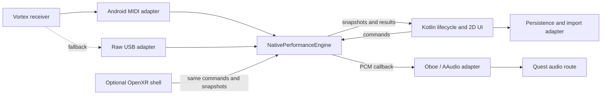

# Native Quest Host

**Status:** Proposed
**Date:** 2026-09-01
**Target:** Meta Quest 3, sideloaded APK

## Decision

Build a native Android APK that makes the Quest the Alesis host. The Quest will
receive MIDI from the Vortex Wireless 2 USB receiver, synthesize audio, own the
transport and looper, present the controls, and send analog audio to a powered
speaker or PA. No Raspberry Pi or network connection is required during a
performance.

This preserves the central decision in
[ADR 0001](../docs/adr/0001-host-owned-realtime-engine.md): the device connected
to MIDI and audio owns all timing-sensitive behavior. The Quest replaces the
Linux host; it does not turn the UI into the timing authority.

Proceed only if the capability and latency gates below pass on the actual Quest,
Vortex receiver, adapter, and speaker. Generic Android support does not prove
that Horizon OS exposes the same feature on Quest.

## Goals

- Operate without a Pi, phone, LAN, or internet connection.
- Preserve protocol v1 behavior for transport, capture, staging, promotion,
  quantization, arpeggiation, drums, metronome, and MIDI channel data.
- Produce stable, playable note-to-sound latency through the Quest headphone
  output.
- Recover safely from USB detach, audio-route change, focus loss, and app pause.
- Start with a conventional 2D control surface; add mixed-reality presentation
  only after the instrument is musically viable.
- Retain a path for comparing the native implementation against deterministic
  TypeScript behavior.

## Non-goals

- Running the current Node server or browser UI inside the headset.
- Reusing Linux ALSA, PipeWire, `pw-cat`, subprocess FluidSynth, or FFmpeg code.
- Bluetooth performance audio.
- MP3 export, user-installed plugins, hand tracking, or spatial panels in the
  first usable build.
- Refactoring the current Pi implementation before Quest feasibility is proven.
- Publishing through the Meta store during the prototype phase.

## Physical Topology

```text
Vortex Wireless 2
  -> Alesis USB receiver (13b2:005e or 13b2:005f)
  -> short USB-A-to-USB-C OTG adapter
  -> Quest 3 USB-C port

Quest 3 headphone output
  -> short shielded 3.5 mm stereo cable
  -> powered speaker, mixer, or PA line input
```

The receiver and adapter must be secured to the headset strap with flexible
strain relief. The USB-C plug must not carry the mass of a rigid adapter while
the performer moves. USB receiver current and Quest battery runtime must be
measured; neither is assumed from a nominal USB rating.

Use the Quest headphone output initially. Confirm clean level and absence of
clipping or ground noise against the intended powered input. Do not design an
analog buffer until measurement shows one is required. USB audio is a later
option because it would compete with the MIDI receiver for the single USB-C port
and require a hub whose power and hot-plug behavior must also be validated.

## Platform Assumptions

| Claim | Current confidence | Required evidence |
| --- | --- | --- |
| Quest can act as USB host for the receiver | Unknown | `UsbManager` enumerates the attached VID/PID repeatedly across cold boots. |
| Horizon OS exposes Android MIDI | Unknown | `FEATURE_MIDI` and `MidiManager` report the receiver and deliver all exercised controls. |
| Raw USB is a viable fallback | Medium | Quest exposes USB host access and grants the APK permission to claim the receiver interface. |
| Quest exposes AAudio through Oboe | High, generic Android fact | Probe opens a low-latency output stream and records the granted format, burst size, sharing mode, and performance mode. |
| The granted audio path is playable | Unknown | Physical note-to-sound measurements meet the latency gate without underruns. |
| In-process FluidSynth is stable on Quest | Unknown | ARM64 build renders the chosen SoundFont for the stress duration within CPU and thermal limits. |
| The 3.5 mm route remains available during USB MIDI | Unknown | Device test confirms simultaneous MIDI reception and analog playback. |

Absence of public Meta documentation for a feature is not proof that the feature
is unavailable. Conversely, Android framework documentation is not a Quest
compatibility statement.

## Architecture



### NativePerformanceEngine

`NativePerformanceEngine` is the deep module and realtime authority. Its
interface is intentionally small:

```cpp
class NativePerformanceEngine {
 public:
  bool enqueueMidi(const MidiPacket& packet) noexcept;
  bool enqueueCommand(const EngineCommand& command) noexcept;
  EngineSnapshot latestSnapshot() const;
  EngineHealth health() const noexcept;
  void requestSilence() noexcept;
};
```

The implementation owns:

- the monotonic audio-frame transport clock;
- input normalization and performance routing;
- arpeggiator, drums, and metronome scheduling;
- current-cycle capture and loop playback;
- staged, previous-staged, promoted, deleted, and raw-quantization data;
- synth selection, voices, effects, and PCM rendering;
- revision and applied-cycle semantics;
- all active-note, sustain, controller, and pitch-bend state.

The interface does not expose the audio callback, queue storage, FluidSynth
objects, or mutable snapshot references. Stream construction and Android
lifecycle are adapters at seams outside this module. The audio adapter calls a
private render interface established during construction.

### Android Shell

Use Kotlin for:

- Activity lifecycle and audio focus;
- USB attach, detach, permission, and device discovery;
- `MidiManager` discovery and opening;
- JNI setup and conversion to fixed-size native command structures;
- 2D UI, status reporting, file picker, and persistence;
- optional OpenXR/Meta XR shell after MVP.

Use C++20 with the Android NDK for the performance engine, FluidSynth wrapper,
and deterministic tests. Build the APK as a separate Gradle project under this
directory. Do not add it to the npm workspace.

## Technology Choices

### MIDI

Try `android.media.midi.MidiManager` first. It supports timestamped USB MIDI on
Android, but support must be verified on Quest. Open the Vortex device's output
port because the direction is named from the hardware's perspective.

If the device appears in `UsbManager` but not `MidiManager`, implement one raw
USB adapter for these two known VID/PID values. That adapter must parse the
actual descriptors rather than assuming interface or endpoint numbers. Reuse
the normalized event vocabulary from `@alesis/engine`: note on/off, pitch bend,
control change, and channel pressure.

The capability probe must exercise keys, aftertouch, pitch control, touch strip,
accelerometer, faders, pads, and sustain. A successful note-on alone is not a
complete compatibility result.

### Audio

Use Oboe over AAudio. Request low-latency performance and the device's native
sample rate, channel count, and frames-per-burst. Exclusive mode may be
requested, but the implementation must accept the configuration actually
granted or fail visibly. Do not hard-code a 48 kHz or exclusive-mode assumption.

The callback fills the supplied PCM buffer directly. It is the master clock for
transport and all scheduled events. Kotlin timers, render frames, and OpenXR
frames never schedule musical events.

Use the analog headphone route for MVP. Bluetooth audio is rejected because its
codec and buffering delay are outside the application and unsuitable for live
instrument monitoring.

### Synthesis

Embed FluidSynth as an ARM64 native library and use its pull rendering functions
inside the engine. Do not spawn a process. Confirm that FluidSynth calls used by
the callback are realtime-safe for the chosen configuration; preload the
SoundFont and allocate voices before starting audio.

Port Neon Pressure only after SoundFont note-to-sound and looper gates pass. Its
TypeScript renderer is useful as a behavioral reference, but a native synth must
be designed for callback execution rather than translated mechanically.

### UI and XR

The MVP is a fixed-distance 2D panel controlled with Quest controllers. It must
show MIDI connection, audio health, transport, synth, staging, promoted takes,
and actionable errors. Every performance operation must work without hand
tracking.

After MVP, the same command/snapshot interface may drive OpenXR panels in
passthrough. XR presentation remains a replaceable adapter; it cannot acquire
FluidSynth state or influence transport timing directly.

Web MIDI/Web Audio are not selected because browser USB exposure and background
lifecycle are additional unknowns, while audio timing would remain under browser
control. A direct TypeScript runtime port would also preserve the current 50 ms
timer architecture, which is inappropriate for native realtime audio.

## Realtime Model

The Oboe callback is the sole consumer of two bounded, preallocated queues:

1. MIDI packets from the Android MIDI or raw USB adapter.
2. Validated engine commands from Kotlin.

Producers attach monotonic timestamps. At stream start, the engine establishes a
mapping between `CLOCK_MONOTONIC` time and audio frame position. Each callback
converts due events to frame offsets within the current buffer. The mapping must
be refreshed after stream recreation and tested for drift; packets with absent
or invalid timestamps are scheduled at the earliest safe frame.

The callback must not:

- allocate, free, lock, wait, or call JNI;
- access files, parse JSON, load SoundFonts, or log;
- publish large snapshots or perform MP3 encoding;
- call UI or lifecycle code.

Queue overflow is a health fault, not silent loss. The engine increments a
counter, schedules an all-notes-off/reset at the next callback, and exposes the
fault in `EngineHealth`. Audio xruns, granted stream properties, maximum callback
duration, queue high-water marks, and late MIDI events are recorded in fixed
counters readable outside the callback.

USB detach, audio disconnect, focus loss, pause, and shutdown set a lock-free
silence request. The next callback releases voices, sustain, and pitch bend. If
the stream has already disappeared, the engine clears the same state before a
new stream can start. Reconnection never resumes held notes implicitly.

Snapshots are copied from a preallocated double or triple buffer at no more than
30 Hz. Kotlin receives immutable copies outside the callback. Waveforms are
fixed-size summaries, not PCM transfers.

## Protocol and Behavior

Protocol v1 remains the behavioral contract, not a binary ABI. Native structures
mirror these existing concepts:

- `transport.state`: `stopped`, `counting-in`, or `playing`;
- capture: current waveform, staged, previous staged, staged audibility, and
  quantization mode;
- promoted takes and one-level delete undo;
- instrument descriptors, parameter values, SoundFont and preset IDs;
- arpeggiator, drum, metronome, count-in, and monitor-only settings;
- engine connectivity, MIDI event count, revision, and last event type.

Do not invent a separate `recording` transport state: capture occurs while the
transport is playing. The native implementation must preserve these invariants:

- rollover displaces staged material into a silent one-cycle recovery slot;
- promoted takes are immutable equal-cycle MIDI layers;
- timing changes with captured material require explicit clearing;
- stop discards partial current capture but preserves staged and promoted takes;
- channel 10 percussion remains percussion;
- sustain, controller data, pressure, and 14-bit pitch bend survive capture and
  replay;
- metronome and drums do not enter captured performance MIDI;
- monitor-only suppresses loop playback without suppressing direct performance.

Commands are converted from Kotlin to fixed native structures before enqueueing.
JSON and Zod do not cross the realtime seam. A command result carries
`accepted`, `revision`, `appliedCycle`, and an optional error. Commands that
change audible behavior apply at a documented audio-buffer or cycle boundary;
the result reports the boundary actually used.

The first native implementation is independent code, checked with shared golden
fixtures generated from existing TypeScript tests for quantization,
arpeggiation, routing, and looper transitions. Generate fixtures only after the
hardware gates pass.

## SoundFonts and Licensing

The prototype may use a developer-supplied SoundFont that is not packaged in the
APK. Before distribution, choose one of:

- a small bundled SoundFont with explicit redistribution terms; or
- first-run import through Android's Storage Access Framework.

Copy imported files into app-private storage so the realtime engine never
depends on a transient document URI. Parse the catalog and presets off the audio
thread, then stop and rebuild the synth before atomically activating a new
prepared instance.

FluidSynth's LGPL obligations and every bundled SoundFont's license are release
gates. Record exact versions, build flags, modifications, notices, source or
relinking obligations, and asset provenance. This document makes no legal
conclusion.

## Persistence and Export

Persist a versioned session document plus normalized MIDI events in app-private
storage. Write through a temporary file and atomically replace the prior valid
session. Persist only outside the callback from immutable engine snapshots and
take data. On schema or checksum failure, retain the bad file for diagnostics
and start a recoverable empty session.

MP3 export is deferred. A later implementation may render takes offline through
the same synth and encode using a supported Android media codec or a bundled
encoder after format and license review. It must not depend on FFmpeg or
FluidSynth subprocesses. WAV export is the simpler first export target.

## Lifecycle and Failure Handling

- Request USB permission when the known receiver attaches; show denial and a
  retry action in the headset.
- Keep explicit handles for the MIDI device, output port, receiver, audio stream,
  and native engine; close each idempotently.
- On pause or focus loss, silence immediately and stop transport. Never continue
  an unattended performance in the background.
- Recreate the audio stream after route or device disconnection, using newly
  negotiated properties.
- On USB detach, silence, mark MIDI disconnected, and wait for deliberate
  reconnect. Do not substitute software MIDI silently.
- Use Android thermal status and battery telemetry outside the callback. Warn
  before critical battery state and reduce visual load before changing audio
  quality.
- Keep the screen awake only during an active performance and document the
  resulting battery cost.
- Persist promoted material after each destructive command and on orderly pause.

The prototype needs USB host declarations and attach filters for the known
VID/PIDs. It should declare MIDI as optional until Quest support is proven so an
absent feature flag does not prevent installation. Storage Access Framework does
not require broad filesystem permission.

## Delivery Plan and Gates

### Gate 0: Capability Probe

Build a throwaway Kotlin APK with no FluidSynth or looper.

Exit criteria:

- record Quest OS/build and reported USB, MIDI, and audio feature flags;
- enumerate both receiver variants available to the project;
- obtain USB permission after cold boot and reconnect;
- receive and timestamp every Vortex control class for ten minutes of movement;
- open Oboe output and record all granted stream properties;
- play a callback-generated tone through the 3.5 mm output while MIDI remains
  connected;
- repeat twenty detach/reattach cycles without rebooting the Quest.

Stop if the receiver cannot be accessed through either MIDI or raw USB, or if
simultaneous USB MIDI and analog output is not possible. Retain the Pi design.

### Gate 1: Note-to-Sound Spike

Add in-process FluidSynth, one developer SoundFont, MIDI normalization, and the
Oboe callback. No looper or XR UI.

Exit criteria:

- measure at least 1,000 physical note-on-to-analog-onset samples;
- report median, p95, p99, maximum, xruns, and late events;
- provisional target: median no more than 15 ms and p99 no more than 25 ms;
- compare the same test and audio threshold with the Pi baseline;
- sustain dense chords with pitch, pressure, chorus, and reverb for 30 minutes;
- no stuck notes, callback queue overflow, audio disconnect, or thermal
  throttling.

The thresholds are provisional product gates, not claimed Quest performance.
Android documentation notes that musicians generally require about 10 ms and
that feature flags alone do not establish measured latency. Stop if repeatable
latency remains worse than the Pi or is not musically acceptable.

### Gate 2: Deterministic Performance Core

Implement routing, transport, arpeggiator, drums, metronome, capture,
quantization, loop playback, staging, promotion, and delete undo.

Exit criteria:

- native tests pass protocol invariant and edge-case suites;
- golden traces match the TypeScript behavior or documented intentional changes;
- event timing is expressed in audio frames, not callback counts or wall time;
- stop, mute, delete, detach, overflow, and focus loss leave no active notes;
- 30-minute maximum-feature stress test has no xrun or timing drift regression.

### Gate 3: Usable 2D Instrument

Add the controller-operated 2D UI, SoundFont import, session persistence,
startup health, and recovery flows.

Exit criteria:

- every current non-export command is reachable without hand tracking;
- no page or dialog hides MIDI/audio failure;
- session survives forced process death and headset restart;
- first-use, permission denial, detach, focus loss, and low-battery paths are
  tested on device;
- dependency and SoundFont distribution reviews pass.

### Gate 4: Optional Mixed Reality

Add passthrough and spatial panels through OpenXR/Meta XR. This adapter consumes
the existing command/snapshot interface. Re-run latency, thermal, battery, focus,
and 30-minute stress tests because XR rendering changes system load.

## Verification Matrix

| Area | Check |
| --- | --- |
| MIDI parser | Fragmented packets, running status, realtime bytes, malformed input, all Vortex event classes. |
| Routing | Multi-channel pitch bend and last-note-channel behavior match current tests. |
| Arpeggiator | All modes/rates, latch, gate, swing, octave bounds, deterministic random source. |
| Looper | Rollover, held notes across boundary, circular quantization, minimum duration, percussion, sustain, bends, mute/delete/undo. |
| Transport | Count-in, cycle rollover, timing clear rule, stop semantics, long-run frame drift. |
| Realtime | Queue overflow, maximum callback duration, no callback allocations/locks/JNI/I/O, xrun counters. |
| Synthesis | Rendered PCM silence/energy/frequency comparisons and parameter sensitivity. |
| Physical latency | At least 1,000 note-to-onset samples with median/p95/p99/max and Pi comparison. |
| Endurance | 30 minutes at maximum realistic polyphony with loops, drums, arpeggiator, metronome, chorus, and reverb. |
| Recovery | USB detach, audio route change, focus loss, pause/resume, forced process death, and twenty reconnect cycles. |
| Device health | Battery drain, receiver current, temperatures, throttling, and granted audio configuration. |

Use an electrical MIDI trigger correlated with captured analog output where
possible. A camera or human tapping measurement is not precise enough for the
latency gate.

## Risks

| Risk | Likelihood | Impact | Mitigation | Kill criterion |
| --- | --- | --- | --- | --- |
| Quest blocks or fails to enumerate receiver | Medium | Critical | Probe `MidiManager`, then raw USB descriptors. | Neither path receives stable complete MIDI. |
| Audio path latency or jitter is excessive | Medium | Critical | Oboe negotiation, callback scheduling, physical measurement, Pi comparison. | Stable tuning remains musically unacceptable or worse than Pi. |
| USB connector resets during movement | Medium | High | Short flexible adapter and strap-mounted strain relief. | Resets persist under realistic movement. |
| FluidSynth causes callback overruns | Medium | High | Preallocation, polyphony cap, effect profiling, smaller SoundFont. | Required feature load cannot run xrun-free. |
| Horizon lifecycle interrupts performance | Medium | High | Focus handling, keep-awake policy, headset testing. | Unpreventable pauses occur in the intended workflow. |
| XR load causes thermal throttling | Medium | Medium | Keep XR out of MVP; reduce visual load first. | Audio regresses whenever required XR mode runs. |
| Analog output is noisy or too weak | Low/unknown | High | Measure intended speaker/mixer; test isolation only if needed. | No compact wired route meets level and noise needs. |
| Third-party license prevents distribution | Low/unknown | High | Audit FluidSynth linkage and chosen SoundFont before packaging. | No acceptable distributable asset/build arrangement exists. |
| Headset battery is too short | Medium | Medium | Measure full workload and support external battery only after USB topology review. | Runtime misses the required performance duration. |

## Open Questions

1. Does the Quest report `FEATURE_MIDI`, and does `MidiManager` expose both known
   receiver revisions?
2. What descriptors and endpoint behavior do the receivers expose if raw USB is
   needed?
3. What sample rate, burst size, sharing mode, and performance mode does Quest
   grant for the 3.5 mm route?
4. What are measured note-to-onset latency and jitter versus the Pi?
5. Does plugging the receiver change or constrain audio routing?
6. What receiver current and total battery drain occur under performance load?
7. Can a conventional Android 2D Activity remain foreground and usable in the
   desired passthrough workflow, or is an OpenXR shell needed earlier?
8. Which SoundFont has acceptable sound, size, and redistribution terms?
9. What behavior should replace MP3 export for the first useful release: session
   only, MIDI export, or WAV render?

## First Week

1. Create an isolated Gradle/NDK capability-probe project in `alesis/quest`.
2. Add a diagnostic screen for OS/build, package features, USB descriptors,
   MIDI devices, audio properties, thermal state, and battery state.
3. Add attach filtering and permission handling for `13b2:005e` and `13b2:005f`.
4. Capture timestamped MIDI event counts and raw bytes for every Vortex control.
5. Add an Oboe callback tone and verify simultaneous MIDI plus 3.5 mm output.
6. Run reconnect and movement tests; record results in
   `CAPABILITY_PROBE_RESULTS.md` with exact hardware and OS versions.
7. Decide go/stop for the FluidSynth note-to-sound spike. Do not port looper or
   UI code before this decision.

## Primary References

- [Alesis Vortex Wireless 2](https://www.alesis.com/products/view2/vortex-wireless-2.html)
- [Android USB host overview](https://developer.android.com/develop/connectivity/usb/host)
- [Android MIDI package](https://developer.android.com/reference/android/media/midi/package-summary)
- [Android native MIDI](https://developer.android.com/ndk/guides/audio/midi)
- [AAudio](https://developer.android.com/ndk/guides/audio/aaudio/aaudio)
- [Android audio latency](https://developer.android.com/ndk/guides/audio/audio-latency)
- [Oboe](https://github.com/google/oboe)
- [FluidSynth source and license](https://github.com/FluidSynth/fluidsynth)
- [FluidSynth interface documentation](https://www.fluidsynth.org/api/)
- [Khronos OpenXR](https://www.khronos.org/openxr/)
- [Meta Horizon developer documentation](https://developers.meta.com/horizon/documentation/)

Quest-specific behavior in this design remains unverified until recorded in the
capability probe results.
