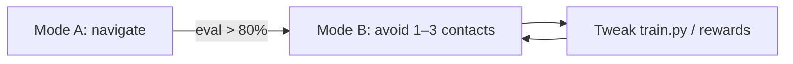

# Boat Navigation RL — MVP Scope

**Goal:** Start playing with training quickly — first **drive to a waypoint**, then **avoid other boats**. Pure Python. A minimal browser replay for eyeballing behavior. Iteration workflow inspired by [karpathy/autoresearch](https://github.com/karpathy/autoresearch): fixed-time experiments, one editable training file, one metric, keep or discard.

Full production path (C++ stack, COLREGs, ONNX) stays in [`SCOPE.md`](SCOPE.md). MVP deliberately ignores that.

---

## What MVP is / isn’t

| In MVP | Later ([`SCOPE.md`](SCOPE.md)) |
|--------|--------------------------------|
| Python sim + transfer-function plant | C++ `bnrl_step` + real COLREGs |
| PPO (Stable-Baselines3) | Same, then export ONNX |
| Dense rewards (goal + CPA) | Post-encounter COLREGs score |
| Up to **3 contacts** | 8 contacts |
| Wind obs **zeroed** (placeholder dims kept) | Real apparent wind |
| Browser **replay** of eval episodes | Shadow mode on boat |
| 10-minute training budget per experiment | Multi-hour production runs |

---

## Learning progression (two modes)

Use one codebase, two modes toggled in `train.py` (or env flag):

### Mode A — **Navigate** (`mode=navigate`)

- Own ship + **goal bearing/speed** (`has_goal=1` always).
- **No contacts** (mask all zero).
- Reward: progress toward goal + small speed tracking − jerk penalty.
- **Eval metric:** `nav_score = fraction of eval episodes with final goal range < 50 m`.

Teach the policy that `(ψ*, V*)` setpoints actually move the boat through the transfer function.

### Mode B — **Avoid** (`mode=avoid`)

- Same as A, plus **1–3 constant-velocity contacts** (randomized spawn).
- Add reward: CPA / minimum-range penalty, big collision terminal penalty.
- **Eval metric:** `avoid_score = success_rate × (1 − collision_rate)` where success = reach goal without collision.

Only turn on Mode B once Mode A eval clears a loose bar (e.g. **>80%** success on fixed eval seeds).



---

## Autoresearch-style layout

Keep the repo small. Three files matter for iteration; everything else is support.

```text
boat_nav_rl/
  MVP.md              ← this doc
  SCOPE.md            ← north star
  program.md          ← experiment playbook (human + agent)
  prepare.py          ← FIXED: scenarios, eval seeds, obs layout, normalization
  train.py            ← EDIT THIS: env rewards, net size, PPO hparams, mode flag
  serve.py            ← tiny static server for viz
  viz/
    index.html        ← top-down replay canvas
    replay.js
  runs/               ← gitignored experiment outputs
  requirements.txt
```

Mirroring autoresearch:

- **`prepare.py`** — don’t modify during agent/human experiments. Defines obs packing (77 floats, wind zeroed, ≤3 active contacts), transfer-function constants, fixed eval scenario list written to `runs/eval_seeds.json`.
- **`train.py`** — the only file you iterate. Env, reward weights, policy `[256,256]`, `n_envs`, learning rate, `mode`, etc.
- **`program.md`** — how to run an experiment, what metric means, what to try next.

### Fixed time budget

Each experiment runs **`TRAIN_BUDGET_SEC = 600`** (10 minutes wall clock), then eval on fixed seeds (~30 episodes, no exploration noise).

Log one line per run:

```text
runs/20260311_143022/
  metrics.json      # { "mode", "train_budget_sec", "nav_score" | "avoid_score", "notes" }
  eval_traces.json  # trajectories for browser viz
  model.zip         # SB3 checkpoint (optional keep best only)
```

Compare runs by **`nav_score`** or **`avoid_score` only** — lower collision rate without goal success is not a win.

At ~100× realtime sim on one core with 8 parallel envs, 10 minutes ≈ **200k–400k env steps** (enough to see if a reward tweak helps).

---

## Sim (Python, MVP)

Minimal 3-DOF world + first-order setpoint tracking:

- State: `(x, y, ψ, V)`; actions: absolute `(ψ*, V*)`.
- Transfer function: first-order lag on heading and speed (same idea as full scope).
- Contacts: constant COG/SOG; bearing/range computed each step from own-ship position.
- `dt = 1.0 s` planner tick; episode max **300 steps** (~5 min sim time).
- Collision: own-ship disk vs contact disk (~20 m radius placeholder).

No OpenFOAM, no C++ build step — `uv run train.py` and go.

---

## Observations & actions (MVP subset of full spec)

Keep **77-dim flat layout** from [`SCOPE.md`](SCOPE.md) so weights transfer later:

- Own ship: heading, speed, yaw rate, local x/y (6)
- Wind: **zeros** (3) — dims reserved
- Contacts: up to **3** active, rest padded; fields = bearing sin/cos, range, cog sin/cos, sog, speed (7 each + mask)
- Goal: bearing sin/cos, speed, `has_goal=1` (4)

Actions: `[desired_heading, desired_speed]` in normalized `[-1,1]` → scaled to physical limits in env.

---

## Browser viz (minimal, not overengineered)

**Not** a training dashboard. Just **replay last eval**.

1. `train.py` writes `runs/<id>/eval_traces.json` — list of episodes, each a sequence of `{t, own:{x,y,ψ}, goal:{x,y}, contacts:[…]}`.
2. `serve.py` serves `viz/` and exposes `GET /api/runs/latest` → symlink or copy to newest run.
3. `viz/index.html` — canvas top-down view, play/pause scrubber, dropdown of recent runs from `runs/*/metrics.json`.

No WebSocket, no React, no live training charts (use terminal + `metrics.json` for that). TensorBoard optional later; skip for MVP.

**Nice-to-have if bored:** overlay min range to nearest contact as a number during replay.

---

## Dependencies

```text
python >= 3.10
gymnasium
stable-baselines3
torch          # SB3 backend
numpy
```

Optional: `uv` for env management (matches autoresearch ergonomics).

---

## Success criteria (MVP done)

You can stop “scoping” and call MVP working when:

1. **Mode A:** ≥80% eval episodes reach goal (<50 m) within 300 steps.
2. **Mode B:** ≥70% eval episodes reach goal with **0% collisions** on 3-contact scenarios.
3. Browser replay shows sensible paths (not spinning in circles).
4. You’ve run ≥5 autoresearch-style 10-min experiments and kept at least one checkpoint that beats the baseline.

COLREGs, wind, ONNX, 8 contacts — explicitly **not** required for MVP done.

---

## Suggested first experiments (`program.md` cheatsheet)

| # | Change in `train.py` | Hypothesis |
|---|----------------------|------------|
| 0 | Baseline PPO, Mode A | Does it learn to steer at all? |
| 1 | Stronger goal progress reward | Faster convergence |
| 2 | Smaller net `[128,128]` | Faster steps, maybe enough |
| 3 | Switch Mode B, mild CPA penalty | Avoid without freezing |
| 4 | Increase collision penalty 10× | Fewer hits, maybe timid |
| 5 | `n_envs=16` if CPU allows | More samples per 10 min |

After each: open browser replay, read `metrics.json`, keep or revert.

---

## Build order (implementation)

1. **`prepare.py`** — obs pack/unpack, transfer fn, 5 eval scenarios (JSON seeds).
2. **`train.py`** — Gym env Mode A, PPO, fixed budget loop, write `metrics.json` + `eval_traces.json`.
3. **`viz/` + `serve.py`** — replay one episode.
4. **Mode B** — contact spawn + CPA reward.
5. **`program.md`** — copy autoresearch tone: setup, run experiment, interpret metric, iterate.

Estimated build: **2–4 days** to first Mode A replay; **+1–2 days** for Mode B + viz polish.

---

## Link to full scope

When MVP gets boring:

| MVP piece | Promote to |
|-----------|------------|
| `prepare.py` obs layout | `boat_nav_rl_interface.h` + `bnrl_observation_to_flat` |
| Transfer fn in Python | C++ plant / your existing model |
| CPA reward | + post-encounter COLREGs from stack |
| `train.py` checkpoint | `export_onnx.py` |
| 3 contacts | 8 contacts + curriculum |

---

## Next step

Implement **`prepare.py`** + **`train.py`** Mode A with the 10-minute budget loop and a stdout line:

```text
[experiment] nav_score=0.73  elapsed=600s  run=runs/20260311_143022
```

Then open `uv run serve.py` and watch it drive.
