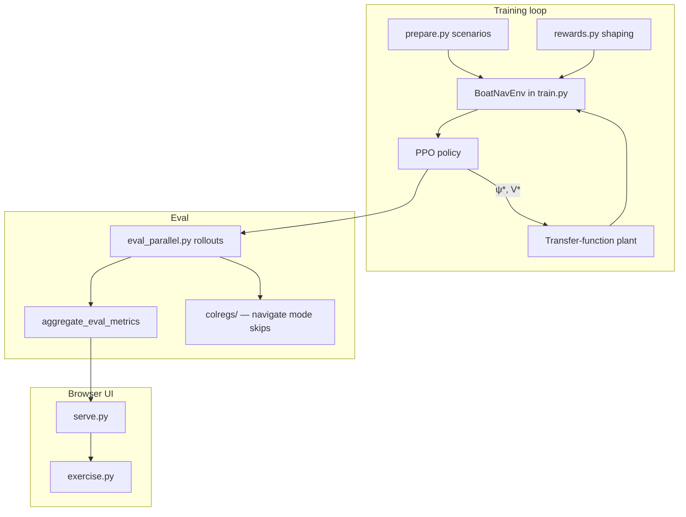

# Boat Navigation RL

Reinforcement-learning stack for training a marine navigation policy that outputs **desired heading** and **desired speed** `(ψ*, V*)` for an autonomous surface vessel. The policy learns to reach waypoints, hold station, avoid traffic, and decelerate for goal-zone stops — evaluated in a Python simulator with a transfer-function plant, dense step rewards, and optional COLREGS protocol scoring.

Pure Python today (Stable-Baselines3 PPO). A C++/ONNX deployment path is scoped in [`SCOPE.md`](SCOPE.md); the observation ABI is defined in [`interface/boat_nav_rl_interface.h`](interface/boat_nav_rl_interface.h).

---

## Quick start

```powershell
cd boat_nav_rl
pip install -r requirements.txt
python prepare.py          # generate scenario seeds (739 train / 395 eval)
python run_tests.py        # 153 tests — should all pass
python train.py            # train until TRAIN_BUDGET_SEC (default 10 min), then eval
python serve.py            # viz + API at http://127.0.0.1:8765
```

Open pages **via the server** (not `file://`):

| Page | URL | Purpose |
|------|-----|---------|
| Train dashboard | http://127.0.0.1:8765/train.html | Start/stop training, live eval charts |
| Scenario overview | http://127.0.0.1:8765/scenarios.html | Thumbnail grid of all eval scenarios |
| Episode replay | http://127.0.0.1:8765/ | Step through eval traces + COLREGS panel |
| Exercise sandbox | http://127.0.0.1:8765/exercise.html | Interactive 3-boat playground |

GPU: `pip install -r requirements-gpu.txt` (CUDA PyTorch).

---

## System overview



**Division of labor**

| Layer | Module | Role |
|-------|--------|------|
| Fixed sim contract | `prepare.py` | Obs layout (77 floats), plant dynamics, scenario seeds, world bounds |
| Environment + training | `train.py` | `BoatNavEnv`, PPO, callbacks, `run_eval()` |
| Mission / waypoints | `mission.py` | Multi-leg goals, hold timers, Exercise-aligned triggers |
| Reward shaping | `rewards.py` | 11-component breakdown (progress, hold, CPA, collision, …) |
| Scenarios | `scenarios.py`, `scenario_templates.py` | Navigate shells, traffic encounters, exercise samplers |
| COLREGS scoring | `colregs/` | Post-encounter safety + rule assignment (Woerner-style) |
| Parallel / async eval | `eval_parallel.py`, `async_eval.py` | Multi-process rollouts; background eval during training |
| Curriculum | `curriculum.py`, `experiments/phase*.json` | Staged phases with exit gates |
| Visualization | `serve.py`, `viz/` | Static UI + REST API |
| Interactive demo | `exercise.py` | Click-to-set goal, live COLREGS status |

---

## Training modes

| Mode | Contacts | COLREGS eval | Primary metric |
|------|----------|--------------|----------------|
| `navigate` | None (masked) | **Skipped** | `nav_score` = mean per-episode mission score; see `nav_score_strict` for legacy binary gate |
| `avoid` | 1–8 traffic contacts | On when traces collected | `avoid_score` = mean per-episode mission score (approach × hold × safety × energy); see `avoid_score_strict` for legacy binary gate |
| `all` | Mixed train split | Per-scenario mode | Whichever applies |

**Success** = reach goal within `GOAL_SUCCESS_RANGE_M` (50 m) and complete the hold timer at minimum speed. **Navigate** mode teaches open-water waypoint following; **avoid** adds CPA penalties, collision terminals, and threat-in-zone terms.

Set mode in `train.py` `CONFIG` or via CLI `--mode`. Curriculum phases override mode and scenario subsets automatically.

---

## Repository layout

```
boat_nav_rl/
├── README.md                 ← this file
├── prepare.py                ← fixed obs/plant/seeds (do not edit during reward experiments)
├── train.py                  ← Gym env, PPO training, eval entry point
├── serve.py                  ← HTTP server for viz + training API
├── exercise.py               ← interactive sandbox backend
├── training_job.py           ← subprocess training launcher for browser UI
│
├── mission.py                ← NavigationMission / waypoint legs
├── rewards.py                ← step reward weights + compute_step_reward()
├── scenarios.py              ← scenario generators (clear, traffic, multi-leg, exercise)
├── scenario_templates.py     ← traffic encounter geometry templates
├── scenario_risk.py          ← kinematic collision-risk audits for QA
├── policy_infer.py           ← thread-safe model.predict wrapper
├── device_util.py            ← CPU/CUDA backend selection
│
├── curriculum.py             ← phased training spec + exit gates
├── checkpoint_util.py        ← best-model save / resume resolution
├── runs_util.py              ← nav_score / avoid_score helpers, latest run id
├── run_analysis.py           ← post-run diagnostics (zone speed, approach speed, …)
├── vecenv_util.py            ← SubprocVecEnv sizing, rollout batch math
├── api_parse.py              ← strict JSON body parsing for serve API
├── eval_parallel.py          ← parallel eval rollouts + metric aggregation
├── async_eval.py             ← background eval thread during training
│
├── colregs/                  ← COLREGS safety + protocol library
│   ├── config.py             ← thresholds, combine modes
│   ├── geometry.py           ← CPA/TCPA, poses from traces
│   ├── entry.py              ← rule assignment (crossing, overtaking, head-on)
│   ├── safety.py             ← range/CPA safety scores
│   ├── evaluate.py           ← per-episode + trace rollup
│   ├── trace_io.py             ← parse own/contact from step dicts
│   ├── live.py               ← per-step live status (Exercise)
│   ├── frame_series.py       ← replay COLREGS score time series
│   └── default_config.json
│
├── experiments/              ← reward JSON overrides per curriculum phase
│   ├── phase0_nav.json
│   ├── phase1_avoid_reach.json
│   ├── phase2_approach.json
│   └── phase3_literal_stop.json
│
├── scripts/
│   ├── agent_train.py        ← short train + JSON diagnostics (agent loop)
│   ├── curriculum_run.py     ← run one or chained curriculum phases
│   ├── eval_run.py           ← re-eval an existing checkpoint
│   ├── analyze_run.py        ← print/JSON run summary
│   └── audit_scenario_collisions.py  ← naive collision audit on seeds
│
├── viz/                      ← static browser UI (no build step)
│   ├── train.html / train.js ← training dashboard + reward breakdown charts
│   ├── scenarios.html        ← scenario overview grid
│   ├── index.html / replay.js← episode replay + COLREGS panel
│   ├── exercise.html / exercise.js
│   ├── chart.js, draw.js, api.js, colregs_panel.js, style.css
│   └── …
│
├── tests/                    ← pytest suite (153 tests)
├── runs/                     ← gitignored experiment outputs
├── interface/                ← C ABI header for future C++ integration
├── render_montage.py         ← optional eval trace image grid
├── render_scenario_overview.py
└── run_tests.py
```

### Planning & reference docs

| Doc | Contents |
|-----|----------|
| [`MVP.md`](MVP.md) | Original MVP scope, autoresearch-style iteration |
| [`SCOPE.md`](SCOPE.md) | Full production architecture (C++ stack, ONNX, 8 contacts) |
| [`TRAINING_CURRICULUM.md`](TRAINING_CURRICULUM.md) | 5-phase curriculum: navigate → avoid → decel → stop → polish |
| [`TESTING.md`](TESTING.md) | Smoke checklist, API health checks |
| [`program.md`](program.md) | Human/agent experiment playbook |
| [`TRAFFIC_PLAN.md`](TRAFFIC_PLAN.md) | Traffic scenario design |
| [`COLREGS_SCORING_PLAN.md`](COLREGS_SCORING_PLAN.md) | COLREGS scoring design notes |
| [`ROBUSTNESS_PLAN.md`](ROBUSTNESS_PLAN.md) | Domain randomization / robust eval |

---

## Core modules

### `prepare.py` — fixed simulation contract

Defines what the policy sees and how the plant responds:

- **77-dim observation**: own state (6), wind (3, often zeroed), up to 8 contacts × 7 fields, contact mask, goal bearing/speed, `has_goal`
- **Transfer-function plant**: heading/speed lag, yaw-rate limits; agile ↔ freighter envelope for domain randomization
- **Scenario seeds**: written to `runs/train_seeds.json` and `runs/eval_seeds.json` via `python prepare.py`
- **World bounds** shared with Exercise (`WORLD_BOUNDS`)

Do not edit during reward-tuning experiments — change `train.py` or `experiments/*.json` instead.

### `train.py` — environment and training

- **`BoatNavEnv`**: Gymnasium env wrapping plant, contacts, currents, mission controller, reward breakdown
- **`NavigationMission`** integration: multi-leg waypoints, delayed reassignments, hold-at-goal
- **PPO** with vectorized envs (`vecenv_util.py`), time-budget callback, live metrics, curriculum checkpoint callback
- **`run_eval()`**: rolls out fixed eval seeds, returns metrics (+ traces when requested)
- **CLI flags**: `--mode`, `--budget`, `--resume`, `--reward-config`, `--curriculum-phase`, device, plant overrides

Key `CONFIG` section at top of file (also overridable via env vars and `run_config.json`).

### `rewards.py` — 11 reward components

| Component | Role |
|-----------|------|
| `progress` | Shaping toward goal range decrease |
| `cross_track` | Penalty for lateral offset from leg line |
| `approach_slow` | Deceleration bonus inside approach band |
| `goal_arrival` | Bonus on entering goal zone |
| `hold_speed` | Reward for low speed during hold |
| `hold_center` | Penalty for drifting inside zone while holding |
| `hold_overspeed` | Penalty for speed above hold threshold in zone |
| `goal_threat_stay` | Penalty for lingering in zone under threat |
| `smooth` | Action jerk penalty |
| `cpa` | Closest-point-of-approach penalty |
| `collision` | Terminal collision penalty |

Weights are tunable via `experiments/*.json` (`reward_weights` key) without code edits. **Gated hold** (Phase 3+) only applies hold rewards when SOG ≤ `hold_stationary_speed_mps`.

### `mission.py` — waypoint missions

Shared by training and Exercise:

- Single-leg and multi-leg scenarios
- Triggers: `start`, `delay_sec`, `progress_frac`, `hold_complete`
- `set_goal()` resets leg progress for Exercise click-to-navigate

### `scenarios.py` — scenario library

Generators produce `ScenarioSeed` records with categories like:

- `clear/*`, `clear/single_leg/*`, `clear/hold_then_go` — navigate mode
- `traffic/crossing_*`, `traffic/beam`, `traffic/overtaking`, `traffic/close_quarters`, `traffic/multi_*` — avoid mode
- `exercise_sampler`, `exercise_spawn`, `multi_leg`, `reassign_*` — Exercise-aligned missions

Train/eval split: 65% train / 35% eval (fixed RNG seed).

### `colregs/` — COLREGS scoring

Python implementation of encounter detection, rule assignment, and safety scoring (aligned with Woerner et al. style metrics):

- **`evaluate_episode()`** / **`rollup_episodes()`** — batch eval metrics (`colregs_mean_safety`, per-rule breakdown)
- **`live_status_for_step()`** — lightweight per-frame status for Exercise
- **`frame_score_series()`** — replay timeline for viz COLREGS panel
- **Gating**: `colregs_enabled_for_mode("navigate")` is `False` — navigation-only training/eval skips COLREGS entirely

### `eval_parallel.py` + `async_eval.py`

Speed up eval without blocking training rollouts:

| Variable | Default | Effect |
|----------|---------|--------|
| `EVAL_WORKERS` | CPU count | Process pool size for parallel rollouts |
| `EVAL_PARALLEL_MIN_SCENARIOS` | `4` | Minimum scenarios before parallelizing |
| `EVAL_ASYNC` | `1` | Background eval thread in live/curriculum callbacks |

Workers load a snapshot checkpoint; temp zips are cleaned up after eval.

### `curriculum.py` — staged training

Five phases (0–4): navigate clear → avoid reach → approach decel → literal stop → full polish. Each phase specifies mode, scenario prefixes, reward config file, budget, and **exit gates** (success rate, zone entry, goal-zone speed, collision rate).

State persisted in `runs/curriculum/state.json`. Run via:

```powershell
python scripts/curriculum_run.py --phase 0
python scripts/curriculum_run.py --chain   # run until a phase fails or all pass
```

---

## Scripts (CLI)

| Command | Purpose |
|---------|---------|
| `python train.py` | Main training + end-of-run eval |
| `python prepare.py` | Regenerate scenario seed files |
| `python serve.py` | Start viz server (default port 8765) |
| `python run_tests.py` | Run full pytest suite |
| `python scripts/agent_train.py --budget 120 --mode avoid --reward-config experiments/phase3_literal_stop.json` | Short agent iteration loop with JSON summary |
| `python scripts/analyze_run.py <run_id> --json` | Diagnostics without retraining |
| `python scripts/eval_run.py <run_id> --max-scenarios 24` | Re-eval saved checkpoint |
| `python scripts/curriculum_run.py --phase 2` | Run curriculum phase with exit gate |
| `python scripts/audit_scenario_collisions.py` | Kinematic collision audit on seeds |
| `python render_montage.py <run_id>` | PNG montage of eval traces (optional) |

Agent iteration guide: [`.cursor/rules/agent-iterate.mdc`](.cursor/rules/agent-iterate.mdc).

---

## HTTP API (`serve.py`)

All routes return JSON. Training pages poll these endpoints.

| Method | Path | Description |
|--------|------|-------------|
| GET | `/api/health` | Server + torch device info |
| GET | `/api/runs` | List recent runs |
| GET | `/api/latest` | Latest completed run payload |
| GET | `/api/runs/<id>` | Metrics + enriched eval traces |
| GET | `/api/history` | Completed runs for train dashboard |
| GET | `/api/train/status` | Active training job status + live metrics |
| GET | `/api/scenarios` | Scenario manifest for overview page |
| GET | `/api/plant/config` | Nominal plant parameters |
| POST | `/api/train` | Start training subprocess |
| POST | `/api/train/cancel` | Request graceful cancel |
| POST | `/api/colregs/frames` | COLREGS score series for replay steps |
| POST | `/api/exercise/init` | Start Exercise session from a run checkpoint |
| POST | `/api/exercise/goal` | Set goal waypoint |
| POST | `/api/exercise/step` | Advance simulation one tick |
| POST | `/api/exercise/reset` | Reset vessels |
| POST | `/api/exercise/intruder` | Spawn traffic contact |
| POST | `/api/exercise/intruders/clear` | Remove all intruders |

---

## Configuration

### `train.py` CONFIG (top of file)

| Setting | Default | Notes |
|---------|---------|-------|
| `MODE` | `avoid` | `navigate` \| `avoid` \| `all` |
| `TRAIN_BUDGET_SEC` | `600` | Wall-clock training limit |
| `N_ENVS` | auto | Parallel rollout envs |
| `GOAL_HOLD_SEC` | `30` | Seconds at goal for success |
| `DYNAMICS_JITTER` | off | Randomize plant per episode |
| `CURRENT_ENABLED` | on | Water current in obs |
| `LIVE_EVAL_SCENARIOS` | `6` | Subset size for periodic live eval |

### Environment variables (common)

| Variable | Purpose |
|----------|---------|
| `TRAIN_BUDGET_SEC`, `N_ENVS`, `TRAIN_DEVICE` | Training overrides |
| `EVAL_WORKERS`, `EVAL_ASYNC`, `EVAL_PARALLEL_MIN_SCENARIOS` | Eval performance |
| `CURRICULUM_PHASE` | Activate curriculum phase in `train.py` |
| `SCENARIO_CATEGORY_PREFIX` | Filter training scenarios (comma-separated) |
| `ROLLOUT_STEPS` | Total steps per PPO rollout (via `vecenv_util`) |

### Experiment JSON (`experiments/`)

Pass to `--reward-config` or curriculum `build_run_config()`:

```json
{
  "reward_weights": {
    "hold_speed": 10.0,
    "hold_overspeed": 6.0,
    "approach_slow": 1.5,
    "hold_stationary_speed_mps": 0.15
  },
  "gated_hold": true,
  "scenario_category_prefixes": ["traffic/crossing_stbd"]
}
```

Legacy keys (`energy`, `hold_station`, `goal_reached`) are aliased or ignored with a warning.

---

## Run outputs (`runs/`)

Each training run creates `runs/<timestamp_id>/`:

| File | Contents |
|------|----------|
| `metrics.json` | Eval aggregates: success/collision rates, scores, reward breakdown means, COLREGS rollup |
| `eval_traces.json` | Per-episode step traces (when collected) |
| `model.zip` | Final PPO checkpoint |
| `best_model.zip` | Best curriculum checkpoint (if applicable) |
| `run_config.json` | Merged config snapshot |

Live training state: `runs/_training/status.json`, `live_metrics.json`.

---

## Testing

```powershell
python run_tests.py
# or
python -m pytest tests/ -v
```

**153 tests** covering: observation layout, plant dynamics, rewards, mission controller, COLREGS geometry/eval, API JSON responses, vecenv sizing, curriculum gates, parallel/async eval, checkpoint resolution, scenario collision audits.

See [`TESTING.md`](TESTING.md) for manual smoke steps.

---

## Deployment path (future)

[`interface/boat_nav_rl_interface.h`](interface/boat_nav_rl_interface.h) defines `BNRL_OBS_FLAT_LEN = 77` and the C struct layout matching `prepare.pack_observation()`. Production plan (ONNX export, C++ `bnrl_step`, authoritative COLREGs in vehicle stack) is in [`SCOPE.md`](SCOPE.md).

---

## Typical workflows

### Autoresearch-style single experiment

1. Edit rewards or PPO knobs in `train.py` CONFIG.
2. `python train.py`
3. Compare `runs/latest/metrics.json` `nav_score` or `avoid_score`.
4. Keep or revert.

### Curriculum (recommended for stop-in-zone + traffic)

1. `python prepare.py`
2. `python scripts/curriculum_run.py --phase 0`
3. Promote only when exit gates pass; state tracks checkpoints in `runs/curriculum/state.json`.
4. Full plan: [`TRAINING_CURRICULUM.md`](TRAINING_CURRICULUM.md).

### Agent reward tuning

```powershell
python scripts/agent_train.py --budget 120 --mode avoid `
  --reward-config experiments/phase3_literal_stop.json --notes "hold tune"
python scripts/analyze_run.py --json
```

Watch `mean_goal_zone_speed_mps` and `pct_goal_zone_at_min_speed` in the JSON output.
