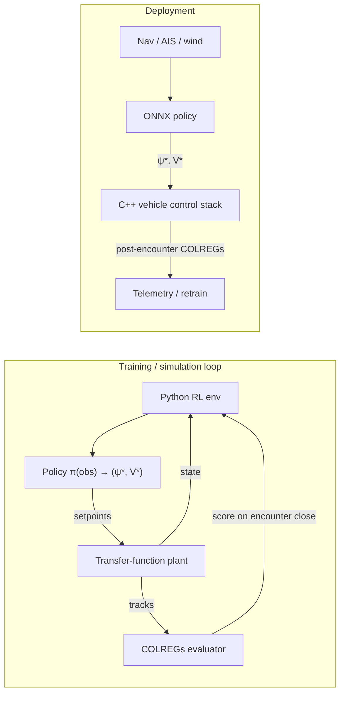

# Boat Navigation RL — Scope & Integration Plan

## Purpose

Train a reinforcement-learning policy that outputs **desired heading** and **desired speed** for an autonomous surface vessel, using own-ship state, apparent wind, and nearby traffic (up to **8 contacts**). The policy is a **local planner** that plugs into an existing **C++ vehicle control stack** in deployment. In simulation, a **transfer-function model** tracks `(ψ*, V*)` setpoints; the C++ stack produces **COLREGs compliance scores after each encounter closes**, which drive training reward.

This document scopes architecture, data contracts, training loop, and phased delivery — not implementation.

---

## System context



**Division of responsibility**

| Layer | Owner | Responsibility |
|-------|-------|----------------|
| Observation assembly | Python (train) / C++ (deploy) | Normalize sensors into fixed-size tensor |
| High-level policy | RL (Python train → ONNX deploy) | `(ψ*, V*)` setpoints |
| Setpoint tracking (sim) | Transfer-function model | `(ψ*, V*)` → achieved heading/speed with lag/rate limits |
| Low-level control (deploy) | C++ stack | Track heading/speed, rudder/throttle, rate limits |
| COLREGs evaluation | C++ stack (same module sim + deploy) | Score each encounter **after it closes**; CPA/TCPA, rule breakdown |
| Traffic / world | Sim env | Constant-velocity or scripted contacts; encounter detection |

The RL agent does **not** output rudder angle or throttle directly. That keeps sim-to-real alignment with your production stack and lets COLREGs logic live in one authoritative C++ module.

---

## Observation space (policy input)

Fixed-size vector. Own-ship position may use a local frame; **contact traffic uses bearing/range plus COG/SOG** (no relative x/y or relative velocity). All angles in radians unless noted; speeds in m/s; distances in metres.

### Own ship (required)

| Field | Dim | Notes |
|-------|-----|-------|
| `heading` | 1 | True heading ψ (or sin/cos pair → 2 dims if you prefer continuity) |
| `speed` | 1 | SOG or through-water speed — **pick one and stay consistent** |
| `yaw_rate` | 1 | Optional but helps predictability |
| `position` | 2 | Local x, y (or omit if policy is translation-invariant and contacts are relative) |

### Apparent wind (required)

| Field | Dim | Notes |
|-------|-----|-------|
| `apparent_wind_speed` | 1 | m/s |
| `apparent_wind_angle` | 2 | sin/cos relative to bow (avoids wrap discontinuity) |

True wind can be derived in C++; policy sees **apparent** only so sail-assist or wind-drift effects are implicit in what the stack exposes.

### Goal / route (optional)

Some missions include a nominal track; others are pure traffic avoidance. Support both via config flag `has_goal`:

| Field | Dim | Notes |
|-------|-----|-------|
| `has_goal` | 1 | 1.0 if goal fields are valid, else 0.0 (always present in flat vector) |
| `goal_bearing` | 2 | sin/cos bearing to goal waypoint in own-ship frame |
| `goal_speed` | 1 | desired speed along route, m/s |

When `has_goal = 0`, zero-fill goal fields. Train with mixed batches (with/without goal) or separate curricula so the policy does not assume a goal is always present.

### Traffic (contacts)

Cap at **`N_max = 8`**. Pad with zeros; use a **contact mask**.

Per contact `i` (order in flat vector):

| Field | Dim | Notes |
|-------|-----|-------|
| `bearing` | 2 | sin/cos true bearing to contact from own ship |
| `range` | 1 | Slant range, m |
| `rel_cog` | 2 | sin/cos contact COG **relative to own bow** |
| `rel_vel_fwd` | 1 | Forward component of relative ground velocity / `REL_VEL_SCALE` |
| `rel_vel_stbd` | 1 | Starboard component of relative ground velocity / `REL_VEL_SCALE` |
| `radius` | 1 | Contact collision radius / `RADIUS_SCALE` |

**Flat size:**  
`own(6) + wind(3) + N_max × contact(8) + mask(N_max) + goal(3) + has_goal(1)`  
With N_max=8 → 6 + 3 + 64 + 8 + 3 + 1 = **85 floats**.

Sort contacts by **range ascending** before padding so the policy sees nearest threats first (order-invariant alternative: set transformer / attention — out of scope for v1).

---

## Action space (policy output)

Continuous, bounded:

| Field | Range | Notes |
|-------|-------|-------|
| `desired_heading` | [0, 2π) or [-π, π) | Absolute heading, **not** delta-ψ (simpler for COLREGs evaluator) |
| `desired_speed` | [V_min, V_max] | V_min > 0 to avoid degenerate “stop” unless COLREGs stack allows stand-still |

Alternative v1: output **Δheading** and **Δspeed** with integration in C++; absolute setpoints are usually easier for rule-based scoring (“did you alter course to starboard?”).

Action post-processing (transfer function in sim; C++ stack in deploy):

- Rate limits on ψ* and V*
- Feasibility clamp (max heel, min steer speed, channel bounds)
- Transfer-function lag from setpoint to achieved state (sim only)

---

## C++ integration contract

Stable **C ABI** so Python training and onboard deployment share one header. Version struct with `uint32_t schema_version`.

### Shared structs (sketch)

```c
// boat_nav_rl_interface.h — illustrative; canonical copy lives with C++ stack

#define BNRL_MAX_CONTACTS 8
#define BNRL_SCHEMA_VERSION 2

typedef struct {
    double timestamp_s;
    double heading_rad;
    double speed_mps;
    double yaw_rate_rps;
    double pos_x_m;
    double pos_y_m;
    double aws_mps;
    double awa_sin;
    double awa_cos;
    uint32_t num_contacts;
    struct {
        double bearing_sin, bearing_cos;
        double range_m;
        double cog_sin, cog_cos;
        double sog_mps;
        double speed_mps;
    } contacts[BNRL_MAX_CONTACTS];
} bnrl_observation_t;

typedef struct {
    double desired_heading_rad;
    double desired_speed_mps;
} bnrl_action_t;

typedef struct {
    double total;                    // [0, 1] or unbounded — document convention
    double rule_applicability;       // was a rule triggered?
    double give_way_obligations;     // did we comply when required?
    double stand_on_obligations;
    double cpa_margin;               // reward for safe passing distance
    double speed_in_separation;      // COLREGs Rule 6 / safe speed heuristic
    /* extend with per-rule breakdown as needed */
} bnrl_colregs_score_t;

typedef struct bnrl_vessel_state bnrl_vessel_state_t;  // opaque sim/runtime state

// Lifecycle
bnrl_vessel_state_t* bnrl_create(const char* config_json);
void bnrl_destroy(bnrl_vessel_state_t* s);

// One control cycle: apply setpoints, advance sim (transfer fn) or live stack
// colregs_out valid only when *encounter_closed_out != 0
int bnrl_step(
    bnrl_vessel_state_t* s,
    const bnrl_action_t* action,
    bnrl_observation_t* obs_out,
    int* encounter_closed_out,
    bnrl_colregs_score_t* colregs_out   /* undefined unless encounter closed */
);

// Fill observation from live sensors without stepping (deploy)
int bnrl_observation_from_sensors(
    bnrl_vessel_state_t* s,
    const /* sensor_snapshot_t */ void* sensors,
    bnrl_observation_t* obs_out
);

// Policy inference hook (optional — or use ONNX Runtime directly in C++)
int bnrl_policy_forward(
    const float* obs_flat,
    size_t obs_len,
    bnrl_action_t* action_out
);
```

### Python training bindings

- **Phase 1:** `ctypes` / `cffi` against a shared library built from the C++ stack.
- **Phase 2:** pybind11 wrapper if you need richer types or batch stepping.

### Deployment inference

- Train in PyTorch → export **ONNX** (`obs_flat` → `[desired_heading, desired_speed]`).
- C++ runs **ONNX Runtime** at control rate (e.g. 1–5 Hz); low-level loop stays at 10–50 Hz.

Document **normalization**: store `obs_mean` / `obs_std` (or min/max) in ONNX metadata or a sidecar JSON loaded by C++.

---

## Reward design

**COLREGs scores arrive after the encounter closes** — not every planner tick. The env must treat each encounter as an event with a start/end (e.g. contact enters CPA horizon → CPA passed / range increasing / contact mask slot cleared).

### Per-step reward (dense, for learning stability)

```text
r_t = w_safe * g(min_range, tcpa)     // geometry from sim; always available
    + w_prog * h(goal_progress)       // only when has_goal
    + w_comf * j(Δψ*, ΔV*)             // optional smoothness
    - w_fail * 1[collision | capsize]
```

Use **`w_safe > 0`** so the policy learns collision avoidance even before any encounter completes. COLREGs compliance is not identical to safety (standing on may score well but pass too close).

### Encounter-closed reward (sparse, authoritative)

When `encounter_closed_out` is set and C++ returns `bnrl_colregs_score_t`:

```text
r_enc = w_col * colregs_total
```

**Credit assignment** — assign `r_enc` to the timesteps that influenced the maneuver:

| Method | When to use |
|--------|-------------|
| **Last-N steps** | Credit last N planner ticks before encounter close (simple baseline) |
| **Eligibility trace** | TD(λ) or n-step return over encounter window |
| **Stored action buffer** | Backprop reward to all steps where contact was in mask |

Log `encounter_id`, `close_time`, COLREGs breakdown, and credited step indices for debugging.

Episode termination:

- Collision (distance < ship length scale)
- Out of bounds / grounding
- Timeout
- Success: reach goal waypoint when `has_goal` (optional)

Episode metrics: mean post-encounter COLREGs over all closed encounters, min CPA, collision rate.

---

## Training environment (Gymnasium-style)

```python
# Conceptual API — not implemented here

class BoatNavEnv:
    """
    reset() -> obs, info
    step(action: np.ndarray) -> obs, reward, terminated, truncated, info
    info includes: colregs breakdown, contact count, raw C++ state ids
    """
```

**Step sequence**

1. Policy outputs `bnrl_action_t` (denormalized).
2. `bnrl_step()` feeds setpoints to the **transfer-function plant**, advances traffic, one tick (Δt = 0.5–2 s typical).
3. Returns next observation; if an encounter closed, also returns `bnrl_colregs_score_t`.
4. Python computes per-step reward + encounter-closed bonus with credit assignment; logs diagnostics.

**Encounter lifecycle (C++ + env must agree)**

- **Open:** contact within scoring horizon (document range/TCPA threshold).
- **Active:** track own-ship and contact tracks for evaluator replay.
- **Closed:** CPA passed, contact leaves horizon, or collision — evaluator emits score once.

**Parallelism:** vectorized envs via subprocess + shared lib per worker, or C++ batch API if you add `bnrl_step_batch()` later.

**Algorithms (practical defaults):**

- **SAC** or **PPO** for continuous actions; start with **PPO** — post-encounter COLREGs are sparse; dense CPA shaping carries early learning.
- Curriculum: 0 → 1 → 3 → 8 contacts; increasing wind; narrowing channels.

---

## Simulation requirements

| Need | v0 | v1 |
|------|----|----|
| Setpoint tracking | **Transfer-function model** `(ψ*, V*)` → state | Tune time constants to match deploy stack |
| Own-ship motion | Integrate achieved ψ, V; optional wind drift | Refine TF from sea trials |
| Contacts | Scripted constant-velocity targets | AIS-like noise, accelerating vessels |
| COLREGs | C++ evaluator; score **on encounter close** | Same module as production |
| Scenarios | Open water crossing | Head-on, crossing, overtaking standard sets |
| Randomization | Contact bearing/range/speed; `has_goal` on/off | + sensor noise on obs |

Regression **scenario suite** (JSON): initial states + contact tracks + expected rule flags — run after each training checkpoint and on C++ stack changes.

---

## COLREGs score contract (for ML team ↔ C++ team)

Agree explicitly on:

1. **Reference point** — own-ship position vs bow/stern for passing situations.
2. **Which rules are scored** — at minimum: head-on (14), crossing (15), overtaking (13), safe speed (6), look-out (5) as proxy features.
3. **Score semantics** — `[0,1]` per step vs `-1/+1` violation/compliance; whether stand-on **inaction** scores positive.
4. **Encounter close criteria** — when exactly the evaluator runs (CPA passed, range threshold, etc.).
5. **Multi-contact** — one score per encounter vs aggregated; document replay inputs for each.

**Decided:** scores are emitted **after encounter close**, not per planner step. RL credit assignment (above) bridges that gap.

---

## Phased roadmap

### Phase 0 — Interface & fixtures (1–2 weeks)

- Freeze `boat_nav_rl_interface.h` + JSON config schema.
- Unit tests: zero contacts, one crossing contact, head-on; obs size and padding.
- Golden vectors: recorded `observation → action` smoke test for ONNX export.

### Phase 1 — Transfer-function sim + Gym wrapper (2–3 weeks)

- Wire existing **transfer-function model** for `(ψ*, V*)` tracking; contact kinematics in env.
- C++ COLREGs evaluator hooked to encounter-close events (or stub with correct call timing).
- Python `BoatNavEnv` + PPO baseline; encounter credit assignment (start with last-N).
- Logging: TensorBoard + per-encounter CSV (COLREGs breakdown, credited steps, min CPA).

### Phase 2 — Real COLREGs scoring + curriculum (3–4 weeks)

- Wire production COLREGs engine into `bnrl_colregs_score_t`.
- Scenario curriculum + reward weight search.
- Validate: policy passes scripted crossing/overtaking tests.

### Phase 3 — Wind & dynamics fidelity (2–3 weeks)

- Apparent wind affects achievable V/ψ rate; verify policy uses wind features (ablation).
- Sensor noise injection on observations.

### Phase 4 — Deployment (1–2 weeks)

- ONNX export + C++ ONNX Runtime path.
- Latency budget: policy ≤ 20 ms on target hardware.
- Shadow mode: log `ψ*, V*` alongside human/autopilot for comparison.

---

## Repository layout (proposed)

```text
boat_nav_rl/
  SCOPE.md                 # this document
  interface/
    boat_nav_rl_interface.h
    schema_config.example.json
  python/
    envs/boat_nav_env.py
    train.py
    export_onnx.py
  cpp/                     # thin wrapper or link to main vehicle repo
    bnrl_bindings.cpp
  scenarios/
    crossing_port.json
    head_on.json
    overtaking.json
  tests/
    test_observation_layout.py
    test_golden_vectors.py
```

C++ control stack and COLREGs engine likely stay in your main vehicle repo; this repo holds the **RL-facing contract** and training code, consumed as a submodule or published artifact (`libbnrl_interface.so` + header).

---

## Decisions (locked / open)

| Decision | Status | Choice |
|----------|--------|--------|
| N_max contacts | **Locked** | 8 |
| COLREGs timing | **Locked** | Score **after encounter closes** |
| Sim plant | **Locked** | Transfer-function model on `(ψ*, V*)` |
| Goal in obs | **Open** | Optional `has_goal` + bearing/speed; train mixed or separate runs |
| Speed in obs/action | Open | SOG vs through-water — match transfer fn / deploy stack |
| Heading output | Open | Absolute ψ* recommended for COLREGs audit trail |
| Control rate | Open | 2 Hz planner typical |
| Credit assignment | Open | Last-N vs eligibility trace — validate on crossing scenarios |
| Multi-agent RL | Open | Independent policies v1 |

---

## Success criteria (v1)

- Policy avoids collisions in **95%+** of 1000 randomized open-water episodes (8 contacts, N_max used).
- Mean COLREGs `total` ≥ **0.85** on standard scenario suite (C++ evaluator).
- ONNX policy runs in C++ shadow mode with identical obs→action mapping as Python (max abs error < 1e-4 on normalized outputs).
- Clear log trail: every episode stores COLREGs breakdown for debugging rule failures.

---

## Out of scope (v1)

- Learned low-level rudder/throttle control
- Full 6-DOF hydrodynamics
- RFMO / local traffic separation schemes beyond COLREGs geometry
- Automatic AIS classification (fishing vs tanker) — contact type can be added to obs later as one-hot

---

## Next step

Implement **Phase 0**: freeze `boat_nav_rl_interface.h` (encounter-close flag, optional goal fields), document encounter-close criteria, and plug the transfer-function model into `bnrl_step`. COLREGs semantics one-pager from C++ team should define exactly what “encounter closed” means.
