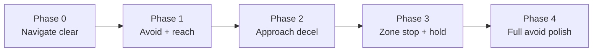

# Incremental training curriculum

Plan for reaching a policy that **navigates in traffic**, **avoids collisions**, **reaches the goal**, and **literally stops** (SOG ≈ 0) for the hold period. Based on experiments through the 8-hour hail mary (`20260614_023053`).

---

## Target behavior (definition of done)

| Capability | Accept criterion (full avoid eval, 296 scenarios) |
|------------|---------------------------------------------------|
| Reach goal zone | `episodes_with_goal_zone_steps` ≥ 80% of episodes that should be reachable |
| Literal stop in zone | `mean_goal_zone_speed_mps` ≤ **0.15**, `pct_goal_zone_at_min_speed` ≥ **0.8** on successful episodes |
| Hold complete | `success_rate` ≥ **0.15** initially, target **0.25+** with CPA-safe hold |
| Safety | `collision_rate` ≤ **0.05** |
| Headline score | `avoid_score` = success × (1 − collision) × energy — maximize, but **never** at cost of zero zone entries |

**Non-goal:** globally slow mean speed with almost no zone entries (hail mary failure mode: 2.9 m/s mean, **6** zone entries).

---

## What failed (and why)

| Approach | Outcome | Lesson |
|----------|---------|--------|
| Global high `energy` weight | Crawl (~1.5 m/s), 0 zone entries | En-route energy fights navigation |
| Fast baseline + hold bonuses only | 7+ m/s in zone, hold timer runs at speed | Bonuses ≠ requirement; need **gated hold** |
| Gated hold + resume fast policy | Still 6+ m/s in zone | Decel is a **separate skill**; 2–10 min not enough |
| Resume from slow checkpoint | Never reaches goals again | **Checkpoint lineage matters** — don’t resume across incompatible behaviors |
| 8h single-phase hail mary | Slower globally (2.9 m/s), zone speed 3.6 m/s, **6** zone entries | One reward soup collapses navigation before stop is learned |

**Root issue:** We asked for **navigate + avoid + decelerate + stop + hold** in one reward vector. PPO finds local optima: *fast through zone*, *crawl everywhere*, or *slow but never arrive*.

**Fix:** **Staged curriculum** — master one capability per phase, **gate advancement on metrics**, carry forward only checkpoints that pass the phase exit criteria.

---

## Curriculum overview



Each phase: fixed **mode/scenario subset**, fixed **reward config**, fixed **time budget**, **exit metrics**. Only promote `runs/<id>/model` when exit criteria pass.

---

## Phase 0 — Clear-water navigation

**Objective:** Learn goal seeking and zone entry at cruise speed. No traffic, no stop requirement.

| Setting | Value |
|---------|--------|
| Mode | `navigate` |
| Scenarios | All navigate eval seeds (~23) |
| Hold gate | Optional: allow hold at any speed **or** `goal_hold_sec=5` for short smoke |
| Energy / stop shaping | **Off** (`energy: 0`, no `hold_overspeed`) |
| Config | `experiments/phase0_nav.json` (to add) |

**Run:**
```powershell
python scripts/agent_train.py --budget 600 --mode navigate --notes "phase0 nav"
```

**Exit criteria (must pass before Phase 1):**
- `success_rate` ≥ **0.85** on navigate eval
- `mean_speed_mps` between **4–6** (cruise band, not crawl)
- Save checkpoint: `runs/<id>/model`

**Estimated budget:** 10–20 min wall clock (often enough); extend if success &lt; 0.7.

---

## Phase 1 — Traffic: reach the zone

**Objective:** Reach goal zone in avoid scenarios without teaching stop yet. Collision avoidance dominates.

| Setting | Value |
|---------|--------|
| Mode | `avoid` |
| Scenarios | Full eval **or** start with `traffic/base_*` + `close_quarters` subset |
| Resume | Phase 0 checkpoint **or** fresh if Phase 0 skipped |
| Hold gate | **Disabled in reward** — temporarily treat hold as 1 step success **or** keep hold timer but **no** `hold_overspeed` / no speed-gated hold |
| Energy | `energy_en_route_frac: 0` (no en-route energy penalty) |
| CPA / collision | Default weights |

**Implementation note:** For this phase only, add `CURRICULUM_PHASE=1` (or run config flag) that sets `HOLD_STATIONARY_SPEED_MPS` very high (e.g. 8.0) so hold credit behaves like the old “any speed in zone” rule, **or** use a one-line env flag `require_stationary_hold=False`. This avoids fighting Phase 3 before the policy can reach the zone under traffic.

**Run:**
```powershell
python scripts/agent_train.py --budget 1200 --mode avoid --resume <phase0_run> `
  --reward-config experiments/phase1_avoid_reach.json --notes "phase1 avoid reach"
```

**Exit criteria:**
- `episodes_with_goal_zone_steps` / eval ≥ **0.5** (half of scenarios touch zone)
- `collision_rate` ≤ **0.10**
- `mean_speed_mps` ≥ **5** (still navigating, not crawl)
- `success_rate` under **old** hold rules ≥ **0.15** (baseline-like)

**Estimated budget:** 20–40 min.

---

## Phase 2 — Approach deceleration (narrow scenario band)

**Objective:** Learn to **slow in the last 200 m**, still at cruise en route.

| Setting | Value |
|---------|--------|
| Mode | `avoid` |
| Scenarios | **Navigate-only + low-traffic** subset first, then widen (see Scenario ladder below) |
| Resume | Phase 1 checkpoint only |
| Rewards | `approach_slow: 1.5`, energy only when `goal_range < 200 m` (already in code via `energy_step_penalty` bands), **no** hold_overspeed yet |
| Hold gate | Still relaxed (Phase 1 behavior) |

**Exit criteria:**
- Mean speed in approach band (trace analysis): **&lt; 3 m/s** when `goal_range < 100 m`
- `episodes_with_goal_zone_steps` not worse than Phase 1 (−10% max)
- `collision_rate` not worse than Phase 1 + 0.02

**Run:** 20–30 min, analyze with:
```powershell
python scripts/analyze_run.py <run_id> --json
```
(Add optional `mean_approach_speed_mps` to `run_analysis.py` if not present — filter steps where range ∈ [50, 200].)

---

## Phase 3 — Literal stop and hold

**Objective:** With navigation intact, turn on **gated hold** at SOG ≤ 0.15 m/s.

| Setting | Value |
|---------|--------|
| Mode | `avoid` |
| Resume | **Phase 2 checkpoint only** (never from slow/hail-mary runs) |
| Plant | `V_MIN_MPS = 0` (current) |
| Rewards | `experiments/phase3_literal_stop.json` — gated hold, `hold_overspeed`, `hold_center`, `approach_slow` |
| Hold gate | `HOLD_STATIONARY_SPEED_MPS = 0.15` |

**Exit criteria:**
- `pct_goal_zone_at_min_speed` ≥ **0.5** on episodes that enter zone
- `mean_goal_zone_speed_mps` ≤ **0.5**
- `success_rate` ≥ **0.10**
- `episodes_with_goal_zone_steps` ≥ **0.4** of eval (navigation not collapsed)

**Estimated budget:** 40–120 min; this is the hard phase. Repeat with same checkpoint if zone entries drop.

---

## Phase 4 — Full avoid polish

**Objective:** Full 296-scenario eval, CPA-safe success, energy in headline score.

| Setting | Value |
|---------|--------|
| Mode | `avoid` |
| Resume | Phase 3 checkpoint |
| Rewards | Literal stop config + default CPA weights |
| Eval | Full eval every run |

**Exit criteria:** Target “definition of done” table above.

**Estimated budget:** Open-ended; 1–8 h fine-tunes from a good Phase 3 checkpoint.

---

## Scenario ladder (within Phase 1–3)

Increase difficulty only when prior band passes exit metrics:

1. `navigate/*` — no contacts  
2. `traffic/base_*`, `traffic/ahead`, `traffic/bearing` — sparse  
3. `traffic/crossing_*`, `traffic/overtaking`  
4. `traffic/close_quarters`, `traffic/multi_*`  
5. `traffic/high_conflict`, `traffic/head_on`  

**Implementation:** Add `--scenario-filter` or env var `TRAIN_SCENARIO_PREFIX=traffic/base` to `train.py` / `agent_train.py` so phases train on subsets without editing seeds.

---

## Checkpoint promotion rules

```
KEEP checkpoint IF:
  phase exit metrics pass
  AND episodes_with_goal_zone_steps did not drop > 20% vs parent
  AND mean_speed_mps did not fall below 4.0 (avoid crawl lock-in)

DISCARD / do not resume IF:
  episodes_with_goal_zone_steps < 50
  OR mean_speed_mps < 2.5 with success_rate == 0
  OR parent was a "crawl" run (012006, 013910, 023053 without zone recovery)
```

**Known good navigation lineage:** `20260613_231816` → `20260614_015807` → `20260614_020546` (pre–literal-stop, fast). Use only for Phase 1–2 if restarting; re-validate after plant change (`V_MIN=0`).

---

## Code / tooling to add (small, high leverage)

| Item | Purpose |
|------|---------|
| `CURRICULUM_PHASE` or `run_config.curriculum_phase` | Toggle relaxed hold vs gated hold without hand-editing rewards |
| `experiments/phase0_nav.json` … `phase1_avoid_reach.json` | One file per phase; agent iterates weights **within** a phase only |
| `mean_approach_speed_mps` in `run_analysis.py` | Phase 2 exit metric |
| `--scenario-filter` on `train.py` | Scenario ladder |
| `scripts/promote_checkpoint.py` | Copy `model.zip` + write `curriculum_state.json` with phase + metrics |
| Train page / metrics: show **zone entries** and **goal-zone speed** alongside score | Prevent “optimizing score into crawl” |

---

## Agent iteration loop (per phase)

1. Run **`python scripts/curriculum_run.py --phase N`** (or `--phase 0 --continue` to chain).  
2. State tracked in **`runs/curriculum/state.json`**.  
3. `analyze_run.py --json` — check **phase exit table**, not just `avoid_score`.  
3. If exit pass → tag run in notes (`phase2 PASS`), promote model.  
4. If fail → adjust weights **within phase constraints** (e.g. Phase 1: never raise `energy`; Phase 3: never lower `hold_overspeed` below 3).  
5. Max 3–5 iterations per phase before revisiting architecture (e.g. hierarchical policy, action masking “speed ≤ X when range &lt; Y”).

---

## Suggested immediate next steps

1. **Implement `curriculum_phase` flag** (relaxed hold for Phase 1–2) — ~30 lines in `train.py` / `rewards.py`.  
2. **Add experiment JSONs** for Phase 0 and Phase 1.  
3. **Re-run Phase 1** from Phase 0 or `20260614_020546`-class checkpoint for **20 min**; confirm zone entries ≥ 50%.  
4. **Only then** Phase 3 with literal stop on that checkpoint — **not** from `20260614_023053`.

---

## Time budget summary

| Phase | Typical wall clock | Cumulative |
|-------|-------------------|------------|
| 0 Navigate | 10–20 min | 20 min |
| 1 Avoid reach | 20–40 min | 1 h |
| 2 Approach decel | 20–30 min | 1.5 h |
| 3 Stop + hold | 40–120 min | 2.5–3.5 h |
| 4 Polish | 1–8 h | optional |

Total to first usable stop-in-zone policy: **~3–4 hours** staged, vs **8 h** monolithic with unclear gradient (what we just saw).

---

## References

- Reward configs: `experiments/phase0_nav.json` … `phase3_literal_stop.json`  
- Analysis: `scripts/analyze_run.py`, `scripts/agent_train.py`  
- Agent rule: `.cursor/rules/agent-iterate.mdc`  
- Hail mary post-mortem run: `20260614_023053`
