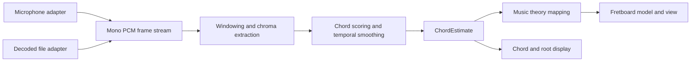

# Jam Assistant

Jam Assistant is a browser-based practice companion that listens to live music,
identifies the current chord and root, and highlights compatible notes on a
guitar fretboard. The same analysis pipeline accepts decoded audio files for
deterministic, faster-than-real-time testing.

## Product goal

Help a guitarist answer three questions at a glance while someone is playing:

1. What chord is sounding now?
2. What is its root note?
3. Where are chord tones and useful scale tones on my fretboard?

The first release is an analysis and visualization tool, not an accompaniment
generator, transcription system, or promise of studio-grade chord recognition.

## MVP experience

The first screen is the working instrument surface:

- A source control selects **Microphone** or **Audio file**.
- A large chord label shows the stable estimate, such as `Cmaj7`.
- A separate root label remains explicit, such as `C`.
- Confidence and an **uncertain** state prevent low-quality guesses from being
  presented as facts.
- A six-string, 12-fret guitar view highlights the root, other chord tones, and
  optional user-selected scale tones with distinct colors and a compact legend.
- Standard tuning (`E A D G B E`) is the MVP default.
- Start/stop, microphone permission, silence, unsupported audio, and analysis
  failure states are visible and recoverable.

File mode includes a scrubber and an analysis-speed selector for development.
It may render results without audible playback. Microphone audio is never
uploaded or retained.

## MVP boundaries

### In scope

- Current-chord recognition for the 12 roots and a deliberately small quality
  vocabulary: major, minor, dominant seventh, major seventh, minor seventh,
  diminished, and suspended fourth.
- Explicit no-chord/uncertain output during silence, transitions, or low
  confidence.
- Root and chord-tone fretboard layers, plus a scale layer only after the user
  selects a named scale.
- Microphone input on current desktop Chrome, Firefox, and Safari.
- Local MP3/WAV loading and offline analysis from decoded PCM.
- Repeatable fixtures, timestamped expected labels, and headless Chromium tests.
- Responsive desktop and mobile layouts.

### Deferred

- Exact voicing, inversion, bass-note, capo, or alternate-tuning recognition.
- Dense extended/altered harmony and slash chords.
- Beat-synchronous transcription, song charts, MIDI, accounts, or cloud storage.
- Source separation for full commercial mixes.
- Native mobile applications.

## Architecture

The detector consumes PCM frames rather than browser audio nodes. This keeps
capture, analysis, and presentation independently testable.



Suggested module boundaries:

```text
src/
  audio/       microphone and decoded-file adapters
  analysis/    framing, chroma extraction, scoring, smoothing
  music/       chord vocabulary, scales, fretboard positions
  components/  source controls, chord display, fretboard
  workers/     analysis worker integration
tests/
  fixtures/    short licensed or generated audio and annotations
  integration/ decoded PCM through detector
  e2e/         browser permissions, file loading, and rendering
```

The central output contract should remain library-independent. Pitch classes
use integers from 0 (`C`) through 11 (`B`), and every feature adapter must emit
12 chroma bins in that same C-to-B order. In particular, Essentia's A-first HPCP
output must be rotated at its adapter boundary.

```ts
type ChordQuality =
  | "major"
  | "minor"
  | "dominant7"
  | "major7"
  | "minor7"
  | "diminished"
  | "suspended4";

type ChordEstimate = {
  timestampSeconds: number;
  confidence: number;
  chroma: readonly number[];
} & (
  | { state: "chord"; rootPitchClass: number; quality: ChordQuality }
  | { state: "no-chord"; reason: "silence" | "unsupported" }
  | { state: "uncertain"; candidateRootPitchClass?: number }
);
```

The UI derives a display symbol from canonical root and quality fields. It does
not accept an independently supplied symbol that could contradict them.

## Detection approach

1. Downmix to mono and normalize sample-rate assumptions at the adapter edge.
2. Analyze overlapping windows and extract a 12-bin chroma/HPCP vector.
3. Compare normalized chroma against templates for the supported vocabulary.
4. Penalize unexplained pitch classes and score a no-chord state.
5. Apply hysteresis or a short rolling vote so labels do not flicker between
   strums while preserving a useful response time.
6. Map the accepted symbol through a music-theory library to fretboard notes.

Chord tones are deterministic from root and quality. A chord generally fits
multiple scales, so the MVP does not choose one implicitly. The optional scale
layer requires an explicit named scale from the user and is checked to contain
the current chord tones before display.

Pitch detection alone is not sufficient: monophonic fundamental-frequency
estimators identify one note, while this product needs pitch-class energy from
several simultaneous notes.

## Testing strategy

The test harness decodes an audio fixture once, slices its PCM as quickly as the
CPU allows, and calls the same analyzer used by microphone mode. It must not use
`audio.play()`, timers, or wall-clock playback. This makes a three-minute input
testable in seconds and avoids headless audio-device behavior.

Test layers:

- Unit tests cover chord templates, confidence thresholds, smoothing, theory
  mappings, and every fretboard position.
- Integration tests feed generated triads, recorded guitar fixtures, silence,
  and chord transitions into the analyzer and compare timestamped outputs.
- Adapter tests verify that all 12 single-pitch fixtures peak in the canonical
  C-to-B chroma bin for each candidate feature library.
- Browser tests verify file decoding, microphone permission/error UI using a
  synthetic media stream, AudioContext activation/interruption, and fretboard
  rendering.
- One headless Chromium benchmark starts from MP3 bytes and includes decoding,
  framing, and analysis in its end-to-end throughput measurement.
- A small evaluation corpus reports chord-weighted recall, no-chord false
  positives, median change latency, and fixture processing speed.

Initial acceptance targets are intentionally product-oriented:

- At least 90% correct stable labels on clean, isolated held-chord fixtures in
  the supported vocabulary.
- Median label stabilization within 500 ms after a clean chord change.
- Silence produces no chord rather than a confident label.
- An MP3 fixture decodes and analyzes at least 10 times faster than its duration
  in headless Chromium CI; PCM-only benchmarks are reported separately.
- The fretboard mapping is exact for every supported chord and root.

Recognition on mixed recordings is an evaluation track, not an MVP gate.

## Delivery plan

### Phase 0: feasibility spike

- Generate labeled fixtures across all 12 roots and every MVP chord quality,
  plus silence and representative transitions.
- Run Essentia.js HPCP and Meyda chroma extraction against decoded PCM in
  Chromium and a test runner.
- Measure accuracy, latency, bundle cost, and faster-than-real-time throughput.
- Decide whether analysis runs in a Web Worker or AudioWorklet plus worker.
- Resolve whether the intended distribution can comply with Essentia.js's
  AGPLv3 terms or needs commercial licensing; otherwise exclude it.

Exit criterion: one analyzer API processes microphone-shaped frames and offline
fixtures with stable labels for clean triads.

### Phase 1: vertical slice

- Scaffold React, TypeScript, Vite, Vitest, and Playwright.
- Implement file input through chord estimate to fretboard rendering.
- Add generated fixtures and deterministic integration tests.

### Phase 2: live input

- Add microphone permissions and capture.
- Request echo cancellation, automatic gain control, and noise suppression off;
  inspect actual track settings and expose when the browser cannot honor them.
- Create or resume the AudioContext from the Start gesture, require a `running`
  state before analysis, and handle later state changes or interruptions.
- Move expensive feature extraction off the UI thread.
- Tune smoothing and uncertainty behavior with guitar input.

### Phase 3: hardening

- Expand the supported chord vocabulary and fixture corpus.
- Test target desktop browsers and responsive layouts.
- Add accessibility, performance budgets, and static HTTPS deployment.

## Decisions to validate in Phase 0

- Whether Essentia.js's WebAssembly build and HPCP algorithms work cleanly in
  the chosen worker and test environments.
- Whether Essentia.js licensing is compatible with the intended distribution.
- Whether its output beats a smaller FFT-to-chroma implementation enough to
  justify bundle and initialization cost.
- The frame/hop sizes that balance bass-note resolution against UI latency.
- Whether simple chord templates are adequate for guitar timbre, or a trained
  classifier is required after the baseline is measured.
- How aggressively confidence and smoothing should suppress transition noise.

See [TECHNOLOGY_RESEARCH.md](TECHNOLOGY_RESEARCH.md) for the technology comparison
and primary sources.
