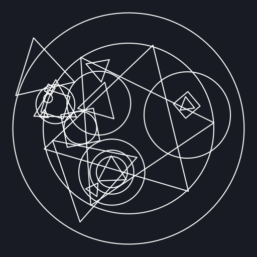
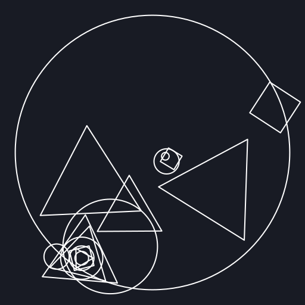
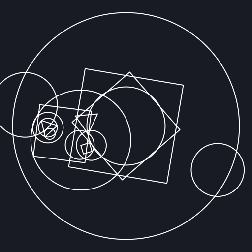

# Sigil Demo

Self-contained JavaScript demo for the sailing-game style procedural sigil generator used by the giant laser effect.

## Run

```bash
cd sigil_demo
python -m http.server
```

Open `http://localhost:8000` and adjust seed/depth/branch controls in the panel.

## Generate static samples

```bash
cd sigil_demo
npm run samples
```

This writes deterministic SVG and PNG files to `sigil_demo/samples/`.

## Sample outputs

### Seed: `materia`



### Seed: `leviathan`



### Seed: `ramuh`


